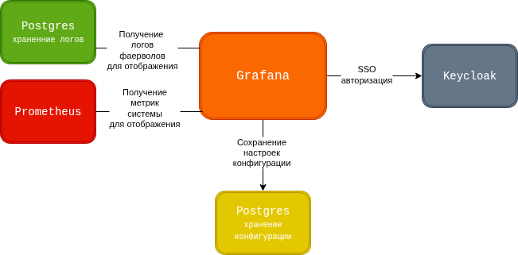

# Описание компонента Grafana

## Общее описание

Grafana – это платформа с открытым исходным кодом, для мониторинга и наблюдения. Она позволяет запрашивать, визуализировать, оповещать и анализировать ваши показатели независимо от того, где они храняться. Этот инструмент создала компания Grana Labs. Инструмент написан большей части на языках TypeScript и  Golang.

  

## Взаимосвязь с другими компонетами




В рамках системы Grafana выступает как инструмент визуализации для:

- Системных метрик хоста на котором развернута система(с помощью компонента Prometheus)
- Системных логов(с помощью компонента Postgres хранящий логи)
- Логов сетевой безопасности(с помощью компонента Postgres хранящий логи)
- Логов управления(с помощью компонента Postgres хранящий логи)

Для проверки авторизации пользователя  и задания прав в Grafana используется компонент системы Keycloak. Главной особенностью является разграничение ролей в Grafana. Также предусмотрено сохранение конфигурации Grafana в ещё один компонент Postgres.

# Описание настройки

Инструмент будет развернут в системе в виде Docker- контейнера в системе управления контейнерами Docker Compose.

## Настройка контейнера в системе

Перед запуском контейнера необходимо указать переменные окружения в двух .env файлах. Первый отвечает за саму работу компонента, а второй за парметры запуска контейнера.

`deploy/grafana/.env` :

  
```
GF_SECURITY_ADMIN_USER=system_admin

GF_SECURITY_ADMIN_PASSWORD=admin

GF_DATABASE_TYPE=postgres

GF_DATABASE_HOST=192.168.130.114:5433

GF_DATABASE_NAME=grafana

GF_DATABASE_USER=grafana_user

GF_DATABASE_PASSWORD=grafana_password

GF_DATABASE_SSL_MODE=disable

GF_AUTH_GENERIC_OAUTH_ENABLED=true

GF_AUTH_GENERIC_OAUTH_NAME=Keycloak

GF_AUTH_GENERIC_OAUTH_CLIENT_ID=grafana-sso

GF_AUTH_GENERIC_OAUTH_CLIENT_SECRET=uAgEvDTaFYvzqr287p2qZFIi7habElf8

GF_AUTH_GENERIC_OAUTH_SCOPES="openid profile email"

GF_AUTH_GENERIC_OAUTH_AUTH_URL=https://192.168.130.114:8443/realms/grafanasso/protocol/openid-connect/auth

GF_AUTH_GENERIC_OAUTH_TOKEN_URL=https://192.168.130.114:8443/realms/grafanasso/protocol/openid-connect/token

GF_AUTH_GENERIC_OAUTH_API_URL=https://192.168.130.114:8443/realms/grafanasso/protocol/openid-connect/userinfo

GF_AUTH_GENERIC_OAUTH_ALLOW_SIGN_UP=true

GF_AUTH_GENERIC_OAUTH_ROLE_ATTRIBUTE_PATH=contains(roles[*], 'SA') && 'GrafanaAdmin' || 'Viewer'

GF_AUTH_GENERIC_OAUTH_ALLOW_ASSIGN_GRAFANA_ADMIN=true

GF_AUTH_GENERIC_OAUTH_LOGIN_ATTRIBUTE_PATH=preferred_username

GF_AUTH_GENERIC_OAUTH_ORG_ATTRIBUTE_PATH=roles

GF_SERVER_PROTOCOL=https

GF_SERVER_CERT_FILE=/etc/grafana/certs/grafana.crt

GF_SERVER_CERT_KEY=/etc/grafana/certs/grafana.key

GF_SERVER_DOMAIN=192.168.130.114

GF_SERVER_ROOT_URL=https://192.168.130.114:3000

GF_AUTH_GENERIC_OAUTH_TLS_SKIP_VERIFY_INSECURE=true
```

`deploy/.env`
  
```
...
GRAFANA_TAG=11.6.0

GRAFANA_VOLUME_PORT=3000

GRAFANA_PORT=3000

GRAFANA_DOMAIN=192.168.130.114
...
```
  

`docker-compose.yml:`

  ```yaml
  grafana:

	image: grafana/grafana:${GRAFANA_TAG}
	ports:
		- ${GRAFANA_VOLUME_PORT}:${GRAFANA_PORT}
	env_file: ./grafana/.env
	volumes:
		- ./grafana/data:/var/lib/grafana
		- ./grafana/provisioning:/etc/grafana/provisioning
		- ./grafana:/etc/grafana/certs
	restart: always
	healthcheck:
		test: ["CMD-SHELL", "curl -k https://localhost:${GRAFANA_PORT}/api/health || exit 1"]
		interval: 10s
		timeout: 5s
		retries: 6
		start_period: 25s
	depends_on:
		configdb:
			condition: service_healthy
		keycloak:
			condition: service_healthy
	networks:
		- continent
  ```


## Особенности настройки

Помимо настроек запуска компонента необходимо указать источники данных и дашборды по умолчнию.

### Источники данных

Там необходимо указать данные базы хранения логов с устройств и Prometheus хранящий метрики хоста


`./deploy/grafana/provisioning/datasources/default.yml`:

  

```yaml
apiVersion: 1

datasources:
  - name: PostgreSQL
    type: postgres
    access: proxy
    url: 192.168.130.112:5432
    database: ksu
    user: ksu_user
    secureJsonData:
	  password: "ksu_password"
    editable: true
    jsonData:
	  database: ksu
	  sslmode: disable

  - name: Prometheus
    type: prometheus
    access: proxy
    url: http://prometheus:9090
    isDefault: true
```

  
### Дашборды

Для возможности указывать дашборды по умолчанию для главной рабочей области Grafana необходимы настройки откуда брать эти дашборды:

`./deploy/grafana/provisioning/dashboards/dashboards.yml`:

  
```yaml
apiVersion: 1

providers:

- name: 'default'
  orgId: 1
  folder: ''
  type: file
  disableDeletion: false
  updateIntervalSeconds: 10
  options:
  path: /etc/grafana/provisioning/dashboards
```
