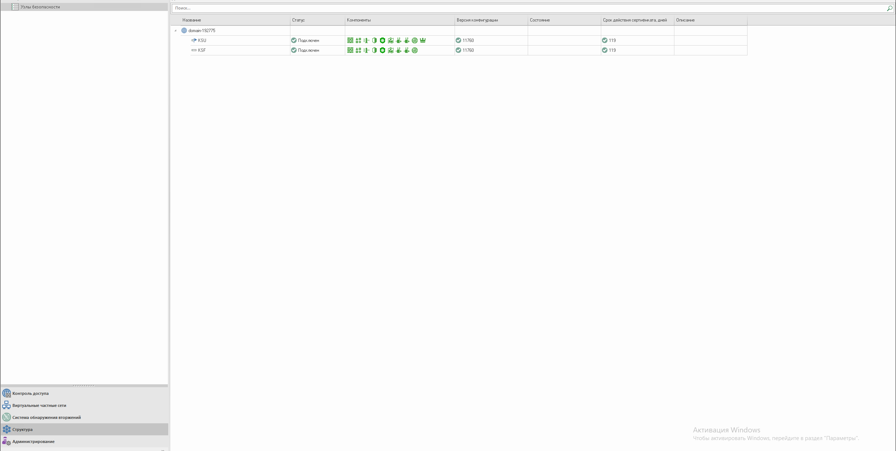
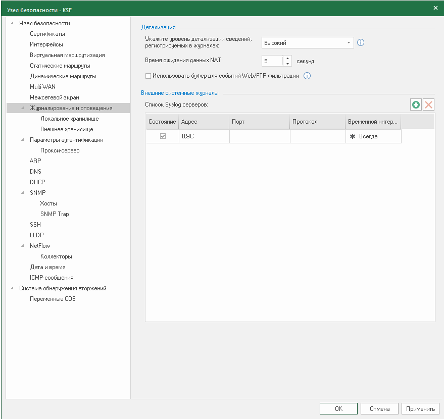
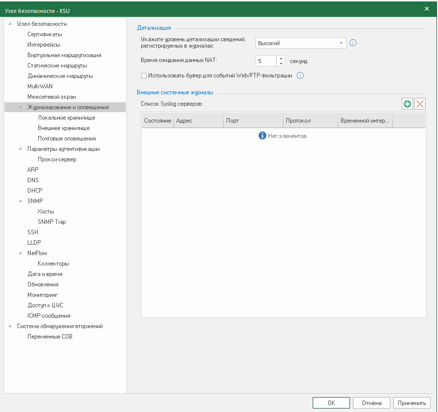
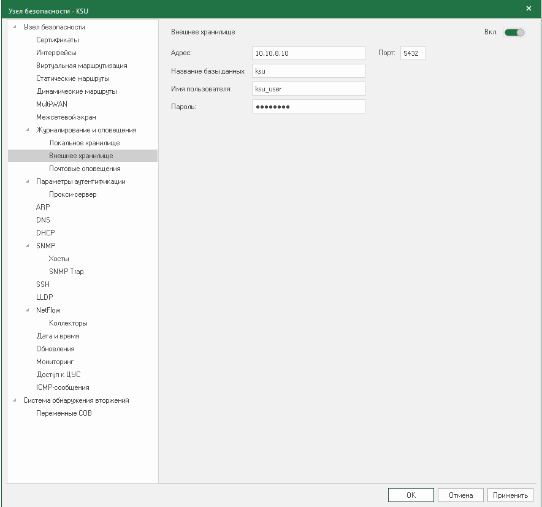
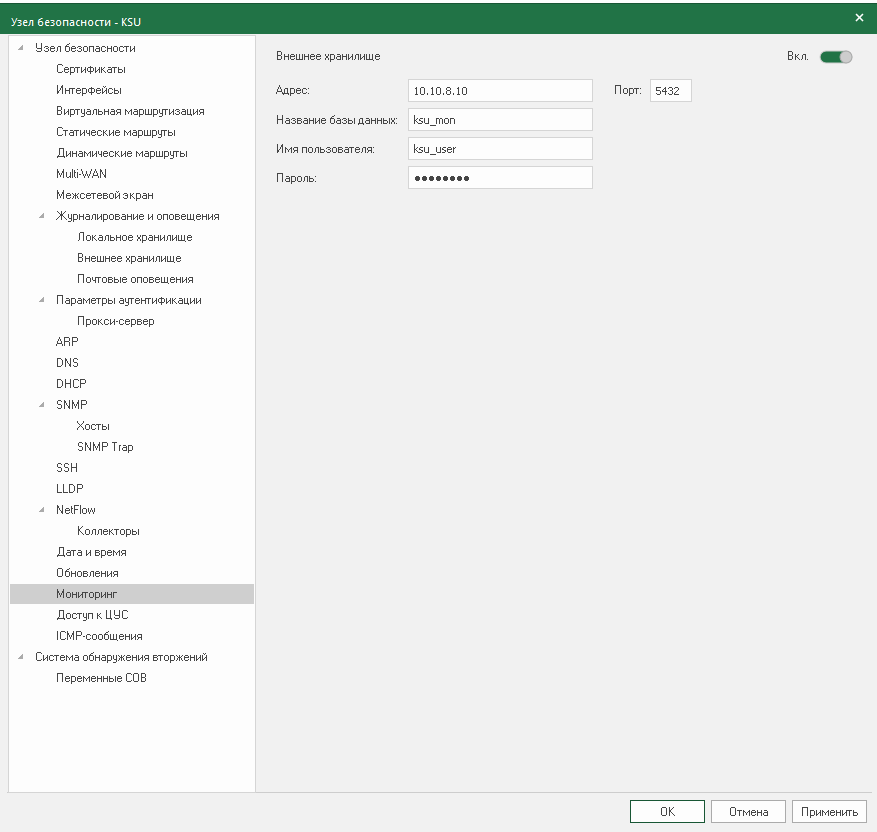
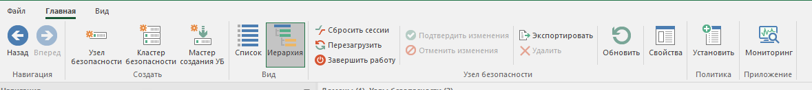

## Настройка отправки логов устройств на устройстве Континент 4

Необходимо понимать что в схеме участвует два узла:
- управляющий-КСУ(KSU)
- подключенный к утправляющему-КСФ(KSF)

Логи с КСФ планируется отправлять на КСУ, а далее сохранять уже во внешнее хранилище.

### Настройка отправки журналов

Для настройки устройств необходимо перейти в рабочую область "Структура". 

Для начала настраивается КСФ на отправку логов в КСУ это реализуется через настройку в панели КСФ во вкладке "Журналирование и оповещение"

Далее на КСУ в той же вкладке необходимо указать высокий уровень логирования.

И во вкладке "Внешнее хранилище" необходимо указать парамметры базы данных в которую будет сохраняться логи.

### Настройка отправка метрик

Для отправки метрик во внешнее хранилище необходимо указать параметры базы храенения.

### Сохранение изменений

Для cохранения изменений необходимо нажать на кнопку "Установить" в верхней панели.

