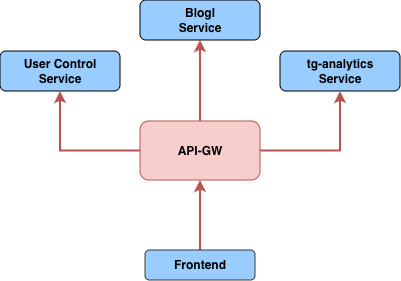

# Сервис api-gw

Сервис `api-gw` — это центральный шлюз, предназначенный для управления и маршрутизации запросов между внешними клиентами (веб-платформой) и внутренними микросервисами. Он обеспечивает безопасность, логирование и единую точку входа для всей системы.

## Основные функции

1. **Маршрутизация запросов**  
   1.a. Перенаправляет HTTP-запросы к соответствующим микросервисам на основе пути:
    - `/v1/users/*` → `UserControl`
    - `/v1/context/*` → `ContextControl`
    - `/v1/blog/*` → `Blog`
    - `/v1/analytics/*` → `Analytics`

2. **Аутентификация и авторизация**  
   1.b. Проверяет JWT-токены перед обработкой запросов.

3. **Логирование и мониторинг**  
   1.c. Фиксирует входящие запросы с уровнями логирования: `debug`, `info`, `warn`, `error`.  
   1.d. Интегрируется с **Loki** для централизованного сбора логов (через Docker).

4. **Документирование API (Swagger/OpenAPI)**  
   1.e. Предоставляет интерактивную документацию по адресу:  
   `http(s)://API_GW_SWAGGER_HOST:API_GW_HTTP_PORT/swagger/index.html`.

5. **Управление запросами**  
   1.f. Принимает запросы от веб-платформы.  
   1.g. Добавляет уникальный ID запроса в заголовки для трассировки.  
   1.h. Устанавливает CORS-заголовки для кросс-доменных запросов.

## Ключевая роль

`API-GW` выступает единой точкой входа для всех API системы, обеспечивая:

- **Безопасность** (валидация токенов, CORS)
- **Масштабируемость** (легкое добавление новых сервисов)
- **Удобство** (централизованная документация и логирование)

## Технологии

- Go (Gin)
- Docker
- Swagger
- Loki

## Интеграции

- **UserControl** — через кодогенерацию по Swagger-документации сервиса
- **ContextControl** — через кодогенерацию по Swagger-документации сервиса
- **Blog** — через кодогенерацию по Swagger-документации сервиса
- **tg-analytics** — через кодогенерацию по Swagger-документации сервиса



## Переменные окружения

```env
# Основные настройки приложения
API_GW_APP_ENV=production           # Окружение приложения (production/development/test)
API_GW_IMAGE_NAME=api-gw            # Название Docker-образа
GIN_MODE=release                    # Режим работы Gin (release/debug)

# Метаданные приложения
API_GW_APP_NAME=api-gw              # Название сервиса API Gateway
API_GW_APP_VERSION=1.0.0            # Версия приложения

# Настройки HTTP-сервера
API_GW_HTTP_HOST=0.0.0.0            # Хост для прослушивания HTTP-сервера
API_GW_HTTP_PORT=8001               # Порт HTTP-сервера

# Настройки логирования
API_GW_LOG_LEVEL=debug              # Уровень логирования (debug/info/warn/error)

# Настройки Swagger
API_GW_SWAGGER_HOST=172.17.134.91   # Хост для доступа к Swagger UI

# Настройки сервиса UserControl
API_GW_USERCONTROL_PROTO=http       # Протокол (http/https)
API_GW_USERCONTROL_HOST=172.17.134.91  # Хост сервиса UserControl
API_GW_USERCONTROL_PORT=8002        # Порт сервиса UserControl

# Настройки сервиса ContextControl
API_GW_CONTEXTCONTROL_PROTO=http    # Протокол (http/https)
API_GW_CONTEXTCONTROL_HOST=172.17.134.91  # Хост сервиса ContextControl
API_GW_CONTEXTCONTROL_PORT=8003     # Порт сервиса ContextControl

# Настройки сервиса ClixonAdapter
API_GW_CLIXONADAPTER_PROTO=http     # Протокол (http/https)
API_GW_CLIXONADAPTER_HOST=172.17.134.91   # Хост сервиса ClixonAdapter
API_GW_CLIXONADAPTER_PORT=8080      # Порт сервиса ClixonAdapter

# Настройки сервиса Blog
API_GW_BLOG_PROTO=http              # Протокол (http/https)
API_GW_BLOG_HOST=172.17.134.91      # Хост сервиса Blog
API_GW_BLOG_PORT=8004               # Порт сервиса Blog

# Настройки сервиса ANALYTICS
API_GW_ANALYTICS_PROTO=http         # Протокол (http/https)
API_GW_ANALYTICS_HOST=172.17.134.91 # Хост сервиса ANALYTICS
API_GW_ANALYTICS_PORT=8005          # Порт сервиса ANALYTICS
```

## Структура проекта
```shell
api-gw
├── build
├── cmd
│   ├── api-gw
│   └── server
├── config
├── data
│   └── keycloak
├── deploy
├── docs
├── internal
│   ├── app
│   │   └── apigw
│   └── controllers
│       └── http
└── pkg
    ├── analytics
    │   ├── common
    │   ├── dashboards
    │   ├── detections
    │   ├── not_implemented
    │   ├── sessions
    │   └── utils
    ├── blogserv
    │   └── operations
    ├── ctxcontrol
    │   └── contexts
    ├── models
    ├── slogger
    └── usercontrol
        ├── auth
        ├── roles
        └── users
```

## Документация OpenAPI

[Swagger JSON](../../src/go/api-gw/docs/swagger.json) 