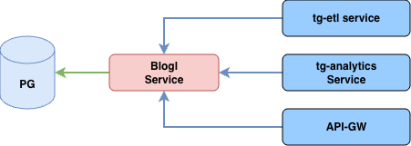

# Blog service

## Общее описание сервиса blog

**Сервис blog** - используется как единая точка управления логами (получение, добавление). Используемая версия языка программирования Go: 1.24.4

### Основные функции
1. Документирование API (Swagger/OpenAPI) - предоставляет интерактивную информацию по адресу http://BLOG_SWAGGER_HOST/swagger/index.html
2. Получение всех логов с фильтрацией и пагинацией
3. Добавление логов

### Зависимости
Для корректной работы требуется предварительно запущенный PostgreSQL



### Таблицы
**Структура таблицы в БД**
```sql
CREATE TABLE business_logs (
  id SERIAL PRIMARY KEY,
  timestamp TIMESTAMP WITH TIME ZONE NOT NULL,
  event_type VARCHAR(10) NOT NULL, -- CREATE, UPDATE, DELETE
  entity VARCHAR(20) NOT NULL, -- user, context
  username VARCHAR(36) NOT NULL,
  user_role VARCHAR(2) NOT NULL, -- SA, CA
  context VARCHAR(50),
  entity_id VARCHAR(50) NOT NULL, -- userID or ContextID
  old_value JSONB,
  new_value JSONB,
  description TEXT
);
```

### Технологии
- **Язык**: Go 1.24.4+
- **API**: REST (Gin), Swagger-документация
- **База данных**: PostgreSQL, драйвер gorm
- **Логирование**: slog со структурированным выводом
- **Документация**: Swagger/OpenAPI
- **Конфигурация**: cleanenv для загрузки настроек
- **Развертывание**: Docker-контейнеры

## Сборка и эксплуатация
Для сборки приложения используется multistage docker build

Требования:
- Хост с установленным docker
- Доступ в интернет для корректной установки базовых образов и загрузки зависимостей
- Установленный make

Все команды по сборке и запуску вынесены в `Makefile`
Поддерживаемые команды:
   `build` - сборка docker образа
   `run` - локальный запуск приложения с использованием компилятора Go
   `stop` - остановка docker контейнера
   `docker-up` - сборка и запуск с использованием docker compose
   `swagger` - генерация swagger документации

## Поддерживаемые переменные среды
**App**
- BLOG_APP_NAME - string ("blog")
- BLOG_APP_VERSION - string ("1.0.0")

**Http server**
- BLOG_HTTP_HOST - string ("127.0.0.1")
- BLOG_HTTP_PORT - string ("8004")
- BLOG_HTTP_TIMEOUT - time.Duration (4s)
- BLOG_HTTP_IDLE_TIMEOUT - time.Duration (60s)

**Уровень логирования**
- LOG_LEVEL - string ("debug")

**Подключение к БД Postgres**
- BLOG_PG_POOL_MAX - int (2)
- BLOG_PG_HOST - string ("1.1.1.1")
- BLOG_PG_PORT - string ("5432")
- BLOG_PG_USER - string ("blog")
- BLOG_PG_PASSWORD - string ("blogpassword")
- BLOG_PG_DBNAME - string ("blog")
- BLOG_PG_SSLMODE - string ("disable")

**Swagger**
- BLOG_SWAGGER_HOST - string ("127.0.0.1"")

## Особенности запросов
Для получения логов необходима Bearer Authorization, токен выдается микросервисом `api-gw`
   В данном токене есть уровни доступа которые влияют на выдачу логов:
   - SA - доступны все логи
   - CA - доступны только логи с ролью CA 
   Если роль не определена - ошибка `there is no suitable role`

Для записи логов авторизация не требуется

## Эндпоинты

#### Получение списка логов

- **Метод:** `GET /api/v1/logs`
- **Параметры:**
   - `page` (query): Номер страницы с 1 default(1)
   - `limit` (query): Количество отображаемых элементов на странице default(10)
   - `role` (query): Фильтр по роли
   - `context_id` (query) Фильтр по contextID
   - `search` (query) фильтр по username/entity/description
- **Требует аутентификации:** Да
- **Описание:** Возвращает список логов по указанным параметрам
- **Ответ:**
   - `200`: Список отфильтрованных логов
   - `400`: Неверный формат параметров
   - `500`: Ошибка при получении списка

#### Добавление лога

- **Метод:** `POST /api/v1/add`
- **Описание:** Добавление логов в БД PostgreSQL
- **Параметры:**
   - `record` (body): Структура записи бизнес лога dto.BusinessLog
- **Ответ:**
   - `200`: Успешное добавление
   - `400`: Неверный формат параметров
   - `500`: Внутренняя ошибка сервера
  
##### dto.BusinessLog
```go
type BusinessLog struct {
	EventType   string `json:"event_type,omitempty"` // CREATE, UPDATE, DELETE
	Entity      string `json:"entity,omitempty"`     // user, context
	Username    string `json:"user_name,omitempty"`
	UserRole    string `json:"user_role,omitempty"` // SA, CA
	Context     string `json:"context,omitempty"`
	EntityID    string `json:"entity_id,omitempty"` // userID or ContextID
	OldValue    any    `json:"old_value,omitempty"`
	NewValue    any    `json:"new_value,omitempty"`
	Description string `json:"description,omitempty"`
}
```

#### Проверка работоспособности сервера

- **Метод:** `GET /api/v1/healthcheck`
- **Описание:** Проверка, что сервер работает
- **Ответ:**
   - `200`: OK

#### Получение версии сервиса

- **Метод:** `GET /api/v1/version`
- **Описание:** Возвращает информацию о версии
- **Ответ:**
   - `200`: Информация о версии