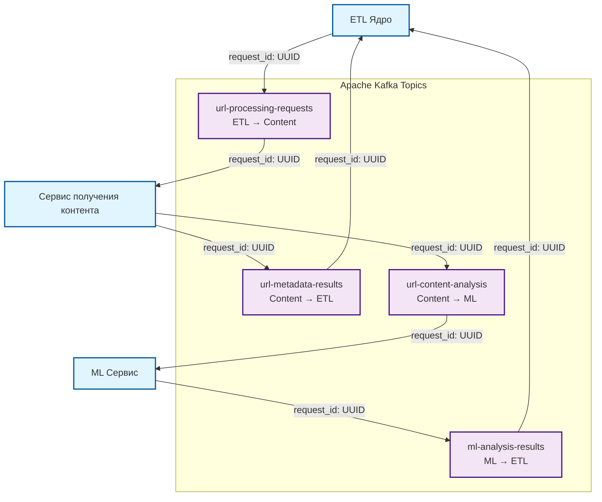

# Общение через Kafka
## Очереди в Kafka:

`ml-analysis-results` - результат анализа контента от ML (ML -> ETL). Содержит UUID данных, которые анализировались + результат анализа в виде присвоения категории(ий) контенту 

`url-content-analysis` - запрос на анализ контента (Сервис получения контента -> ML). Содержит метаданные и UUID, указывающий на сущность в базе данных, которая содержит контент

`url-metadata-results` - результат получения метаданных (Сервис получения контента -> ETL)

`url-processing-requests` - запрос на получение контента и метаданных по url/domain/ip (ETL -> Сервис получения контента)

Данные в очередь класть в виде JSON
Предлагайте структуры данных

## Жизненный цикл запроса:
1. ETL Ядро генерирует новый `request_id` (UUID) и отправляет запрос в очередь `url-processing-requests`
2. Сервис получения контента получает запрос, извлекает контент и метаданные, затем отправляет:
- Метаданные в `url-metadata-results` с тем же `request_id`
- Контент для анализа в `url-content-analysis` с тем же `request_id`
3. ML Сервис получает контент, выполняет анализ и отправляет результаты в `ml-analysis-results` с тем же `request_id`
4. ETL Ядро получает результаты из обеих очередей (`url-metadata-results` и `ml-analysis-results`) и связывает их по `request_id`



## Общение через `url-processing-requests`
Отличная задача! Приведу несколько примеров JSON-структур, соответствующие структуры на Go и их описание.

### Описание структуры

#### Назначение полей:

**`request_id`** - UUID запроса на аниз контента

**`src`** - источник запроса:
- `ip` - IP-адрес клиента, с которого выполняется запрос

**`dst`** - цель анализа:
- `type` - тип ресурса: `ip`|`domain`|`url`
- `resource` - сам ресурс (IP-адрес, доменное имя или полный URL)
- `port` - опциональный порт (если не указан, проверяются стандартные порты)
- `proto` - опциональный протокол (если не указан, проверяется сначала HTTPS, потом HTTP)
- `content_id` - опциональный ID контента в БД (если не указан, контент нужно получить)

#### Логика работы по умолчанию:

1. **Порт**: если не указан, проверяются порты в порядке: 443, 8443, 80, 8080
2. **Протокол**: если не указан, сначала проверяется HTTPS, потом HTTP  
3. **Контент**: если `content_id` не указан или пустой, контент нужно получить из целевого ресурса


### Примеры JSON-структур

#### Пример 1: Полный URL с контентом
```json
{
  "request_id": "a1b2c3d4-e5f6-7890-abcd-ef1234567890",
  "src": {
    "ip": "192.168.1.100"
  },
  "dst": {
    "type": "url",
    "resource": "pupok.xxx.com/se/be/me/bi.html",
    "port": 443,
    "proto": "https",
    "content_id": "2b325e4b-49ea-4659-82bb-7a8385a1ed8d"
  }
}
```

#### Пример 2: Домен без порта
```json
{
  "request_id": "a1b2c3d4-e5f6-7890-abcd-ef1234567890",
  "src": {
    "ip": "10.0.0.50"
  },
  "dst": {
    "type": "domain",
    "resource": "google.com",
    "proto": "https"
  }
}
```

#### Пример 3: IP с портом
```json
{
  "request_id": "a1b2c3d4-e5f6-7890-abcd-ef1234567890",
  "src": {
    "ip": "172.16.254.10"
  },
  "dst": {
    "type": "ip",
    "resource": "80.23.143.56",
    "port": 8080,
    "proto": "http"
  }
}
```

#### Пример 4: Минимальные данные
```json
{
  "request_id": "a1b2c3d4-e5f6-7890-abcd-ef1234567890",
  "src": {
    "ip": "127.0.0.1"
  },
  "dst": {
    "type": "ip",
    "resource": "80.23.143.56",
    "port": 8080,
  }
}
```
Или
```json
{
  "request_id": "a1b2c3d4-e5f6-7890-abcd-ef1234567890",
  "src": {
    "ip": "127.0.0.1"
  },
  "dst": {
    "type": "url",
    "resource": "pupok.xxx.com/se/be/me/bi.html",
    "proto": "https",
  }
}
```

#### Пример 5: URL с HTTP
```json
{
  "request_id": "a1b2c3d4-e5f6-7890-abcd-ef1234567890",
  "src": {
    "ip": "192.168.0.15"
  },
  "dst": {
    "type": "url",
    "resource": "test-server.local/api/v1/data",
    "port": 8080,
    "proto": "http",
    "content_id": "f8d7e6c5-b4a3-4256-81c9-1a2b3c4d5e6f"
  }
}
```

### Структура на языке Go

```go
package main

import (
    "encoding/json"
    "fmt"
    "github.com/google/uuid"
)

// AnalysisRequest представляет структуру запроса на анализ
type AnalysisRequest struct {
    RequestID uuid.UUID   `json:"request_id"` // UUID для трассировки запроса через все сервисы
    Src       Source      `json:"src"`
    Dst       Destination `json:"dst"`
}

// Source содержит информацию об источнике запроса
type Source struct {
    IP string `json:"ip"` // IP-адрес клиента, с которого исходит запрос
}

// Destination содержит информацию о цели анализа
type Destination struct {
    Type      DestinationType `json:"type"`       // Тип ресурса: ip, domain или url
    Resource  string          `json:"resource"`   // Сам ресурс (IP, домен или URL)
    Port      *int            `json:"port,omitempty"`      // Порт (опционально)
    Proto     *Protocol       `json:"proto,omitempty"`     // Протокол (опционально)
    ContentID *string         `json:"content_id,omitempty"` // ID контента в БД (опционально)
}

// DestinationType определяет типы ресурсов
type DestinationType string

const (
    DestinationIP     DestinationType = "ip"
    DestinationDomain DestinationType = "domain"
    DestinationURL    DestinationType = "url"
)

// Protocol определяет поддерживаемые протоколы
type Protocol string

const (
    ProtocolHTTP  Protocol = "http"
    ProtocolHTTPS Protocol = "https"
)

// Метод для создания нового запроса с автоматической генерацией UUID
func NewAnalysisRequest(srcIP string, dstType DestinationType, resource string) *AnalysisRequest {
    return &AnalysisRequest{
        RequestID: uuid.New(),
        Src:       Source{IP: srcIP},
        Dst:       Destination{
            Type:     dstType,
            Resource: resource,
        },
    }
}

// Пример использования
func main() {
    // Создание запроса с автоматической генерацией UUID
    request := NewAnalysisRequest("192.168.1.100", DestinationURL, "pupok.xxx.com/se/be/me/bi.html")
    
    // Установка опциональных полей
    port := 8080
    proto := ProtocolHTTP
    contentID := "2b325e4b-49ea-4659-82bb-7a8385a1ed8d"
    
    request.Dst.Port = &port
    request.Dst.Proto = &proto
    request.Dst.ContentID = &contentID
    
    // Сериализация в JSON
    jsonData, err := json.MarshalIndent(request, "", "  ")
    if err != nil {
        panic(err)
    }
    
    fmt.Println("Request JSON:")
    fmt.Println(string(jsonData))
}
```
