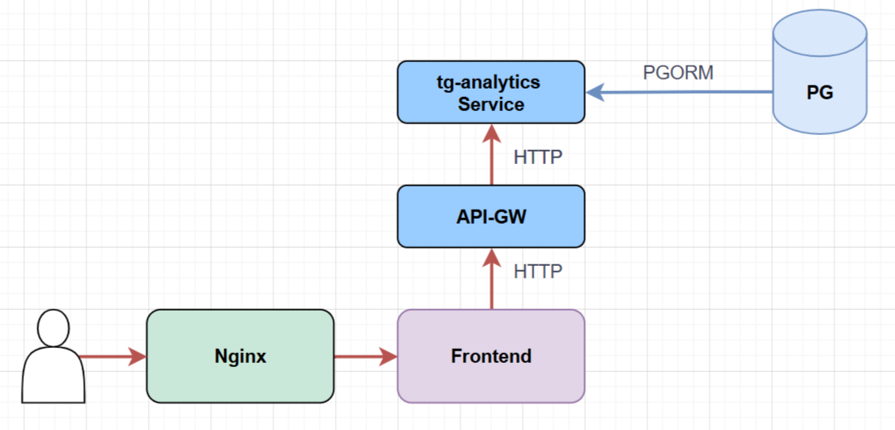

# tg-analytics service

## Общее описание сервиса tg-analytics (tg-an)

**Сервис tg-analytics** - tg-analytics - это централизованная аналитическая платформа для системы Traffic Guard, предназначенная для мониторинга, анализа и визуализации сетевой активности с акцентом на безопасность и контроль контента. Используемая версия языка программирования Go: 1.24.2

### Основные функции

1. Предоставление аналитической инофрмации для фронтенда:
   - подозретельные сессии на сетевых узлах безопасности
   - выявленные подозрительные домена
   - дашборды, отражающие текущий статус и параметры функционирования системы
   - отчеты по всем сетевым узлам и по конкретному узлу безопасности
2. Управление решениями по выявленным подозрительным доменам (разрешение или блокирование)
3. Разграничение доступа на основе ролевой модели (роли: SA и CA)
4. Документирование API (Swagger/OpenAPI) - предоставляет интерактивную информацию по адресу http(s)://AN_SWAGGER/swagger/index.html
5. Логирование и мониторинг:
    - Фиксирует входящие запросы с уровнями логирования: debug, info
    - Интегрируется с Loki для централизованного сбора логов (через Docker)

### Ключевая роль

1. Мониторинг безопасности в реальном времени
Обнаружение и классификация подозрительной активности
   - Анализ аномалий в сетевом трафике
   - Выявление потенциальных угроз и нарушений политик безопасности

2. Аналитика сетевого трафика
Статистика входящего/исходящего трафика по устройствам
   - Мониторинг паттернов сетевой активности
   - Выявление нехарактерного поведения устройств

3. Контент-фильтрация и категоризация
Классификация веб-ресурсов по категориям (более 30 категорий)
   - Анализ доступа к запрещенному контенту
   - Статистика по наиболее запрашиваемым категориям
4. Управление инцидентами безопасности
Обнаружение нарушений политик доступа
   - Триггеры на подозрительные действия
   - Возможность принятия решений (разрешить/заблокировать домены)

### Зависимости

Для корректной работы LC требуется предварительно запущенные PostgreSQL, Loki.

### Интеграция в системе

[Ссылка на drawio](./Интеграция%20tg-analytics.drawio)  



### Последовательность запуска

1. Подготовка контекста и логгера

    ``` go
    ctx := context.Background()
    logger := *cslogger.NewColorLogger()
    ```

   - Создаётся базовый контекст (context.Background).
   - Инициализируется логгер для вывода информации.

2. Формирование DSN для подключения к БД

    ``` go
    dsnETL := getDSN(cfg.ETL.Host, cfg.ETL.User, cfg.ETL.Pass,
        cfg.ETL.DBName, cfg.ETL.Port, cfg.ETL.SSLMode)
    ```

   - На основе конфигурации (cfg) формируется строка подключения (DSN) к первой БД (ETL).
   - Аналогично создаётся dsnMetrics для второй БД (Metrics).

3. Установка соединений с базами данных

    ``` go
    db, err := createConnection(ctx, dsnETL, cfg.ETL.PoolMax, logger, false, models.Session{})
    mdb, err := createConnection(ctx, dsnMetrics, cfg.Metrics.PoolMax, logger, false, models.StatsJSON{})
    ```

    - Для каждой БД:
        - Вызывается createConnection с параметрами: контекст, DSN, размер пула, логгер, флаг автомиграции, модели.
        - Выполняется проверка здоровья соединения (HealthCheck).
        - При ошибке — логирование и выход из функции.

4. Создание бизнес‑логики (use case)

    ``` go
    u := usecase.New(db, mdb, logger)
    ```

   - Инициализируется объект usecase, который объединяет:
     - репозиторий ETL (db);
     - репозиторий Metrics (mdb);
     - логгер.

5. Создание HTTP‑сервера

    ``` go
    server := httpserver.New(cfg, logger, u)
    ```

    - Создаётся экземпляр HTTP‑сервера с передачей:
      - конфигурации;
      - логгера;
      - бизнес‑логики (usecase).

6. Запуск сервера в горутине

    ``` go
    go func() {
        if err := server.Start(); err != nil && err != http.ErrServerClosed {
            logger.ErrorContext(ctx, "analytics service", wsl.Err(err))
        }
    }()
    ```

    - Сервер запускается в отдельной горутине, чтобы не блокировать основной поток.
    - Обрабатываются ошибки запуска (кроме http.ErrServerClosed).

7. Настройка обработки сигналов ОС

    ``` go
    signalChan := make(chan os.Signal, 1)
    signal.Notify(signalChan, os.Interrupt)
    ```

    - Создаётся канал для получения сигналов ОС.
    - Подписываемся на сигнал SIGINT (Ctrl + C).

8. Ожидание сигнала прерывания

    ``` go
    <-signalChan
    ```

    - Основной поток блокируется и ждёт сигнала от ОС.

9. Остановка сервера при получении сигнала

    ```go
    ctx, cancel := context.WithTimeout(context.Background(), 5*time.Second)
    defer cancel()
    if err := server.Stop(ctx); err != nil {
        logger.ErrorContext(ctx, "analytics service", wsl.Err(err))
    }
    ```

    - Создаётся контекст с таймаутом 5 секунд для graceful shutdown.
    - Вызывается server.Stop(ctx) для корректного завершения:
    - закрываются соединения;
    - освобождаются ресурсы;
    - завершается обработка текущих запросов.
    - При ошибке — логирование.

### Технологии

- **Язык**: Go 1.24.2+
- **API**: REST (Gin), Swagger-документация
- **База данных**: PostgreSQL
- **Логирование**: slog со структурированным выводом
- **Документация**: Swagger/OpenAPI
- **Конфигурация**: cleanenv для загрузки настроек
- **Развертывание**: Docker-контейнеры

## Переменные окружения и параметры конфигурации

``` env
# tg-an analytics service

# ==========================================
# ОСНОВНЫЕ НАСТРОЙКИ ПРИЛОЖЕНИЯ
# ==========================================

# Название аналитического микросервиса для идентификации в логах и мониторинге
AN_APP_NAME=tg-an

# Версия приложения для управления релизами и отслеживания изменений
AN_APP_VERSION=1.0.0

# Уровень детализации логирования (debug - полная отладка, error - только критические ошибки)
AN_LOG_LEVEL=debug


# ==========================================
# НАСТРОЙКИ БАЗЫ ДАННЫХ ETL
# ==========================================

# БАЗА ДАННЫХ ETL (основные структурированные данные):
# Максимальное количество соединений в пуле подключений к ETL БД
AN_ETL_POOL_MAX=2
# IP-адрес или домен сервера PostgreSQL с ETL данными
AN_ETL_HOST=192.168.130.112
# Порт сервера PostgreSQL для ETL базы
AN_ETL_PORT=5433
# Имя пользователя для аутентификации в ETL БД
AN_ETL_USER=etl_user
# Пароль пользователя для доступа к ETL БД
AN_ETL_PASS=etl_password
# Название ETL базы данных с обработанными логами
AN_ETL_DBNAME=etl
# Режим SSL подключения к ETL БД (disable - без шифрования)
AN_ETL_SSLMODE=disable


# ==========================================
# НАСТРОЙКИ HTTP СЕРВЕРА
# ==========================================

# Порт для HTTP API сервера аналитического микросервиса
AN_HTTP_PORT=7000
# Сетевой интерфейс для прослушивания HTTP запросов (0.0.0.0 - все доступные интерфейсы)
AN_HTTP_HOST=0.0.0.0


# ==========================================
# НАСТРОЙКИ ДОКУМЕНТАЦИИ API
# ==========================================

# Базовый URL для Swagger документации и доступа к API документации
AN_SWAGGER=192.168.130.112:7000


# ==========================================
# НАСТРОЙКИ БАЗЫ ДАННЫХ METRICS
# ==========================================

# БАЗА ДАННЫХ METRICS (агрегированные метрики и аналитика):
# Максимальное количество соединений в пуле подключений к Metrics БД
AN_METRICS_POOL_MAX=2
# IP-адрес или домен сервера PostgreSQL с метриками
AN_METRICS_HOST=192.168.130.112
# Порт сервера PostgreSQL для Metrics базы
AN_METRICS_PORT=5432
# Имя пользователя для аутентификации в Metrics БД
AN_METRICS_USER=ksu_user
# Пароль пользователя для доступа к Metrics БД
AN_METRICS_PASS=ksu_password
# Название базы данных с агрегированными метриками и аналитикой
AN_METRICS_DBNAME=ksu_mon
# Режим SSL подключения к Metrics БД (disable - без шифрования)
AN_METRICS_SSLMODE=disable
```

## Развертывание в системе

Для развертывания на целевой системе необходимо выполнить следующие шаги:

1. Скопировать папку проекта на целевую систему
2. Настроить переменные окружения или config.yaml
3. Запустить миграции базы данных (при необходимости)
4. Собрать и запустить контейнер:

```bash
cd ./tg-analytics
docker build -t tg-an .
docker run -d --name tg-an -p 7000:7000 tg-an
```

## Документация OpenAPI

> Для просмотра: откройте файл в VS Code и нажмите `F1` → `Preview Swagger`. (Должно быть установлено расширение Swagger Viewer для VS Code)

- [OpenAPI spec (YAML)](../../src/go/tg-analytics/docs/swagger.yaml)  
- [Swagger JSON](../../src/go/tg-analytics/docs/swagger.json)  

### Analytics API Endpoints

#### Общие эндпоинты

##### Получение списка категорий контента

- **Метод:** `GET /api/v1/categories`
- **Описание:** Возвращает список всех уникальных категорий контента из системы
- **Ответ:**
  - `200`: Список категорий контента (массив строк)
  - `500`: Ошибка при получении списка категорий

##### Получение списка имен устройств

- **Метод:** `GET /api/v1/devices`
- **Описание:** Возвращает список всех уникальных имен устройств (хостов) из системы
- **Требует аутентификации:** Да
- **Ответ:**
  - `200`: Список имен устройств (массив строк)
  - `500`: Ошибка при получении имен устройств

#### Дашборды

##### Получение информации об аномалиях

- **Метод:** `GET /api/v1/dashboards/anomalies`
- **Описание:** Получение статистики об аномалиях за указанный период
- **Параметры:**
  - `from` (query): Начало временного диапазона (по умолчанию: now-10m)
  - `to` (query): Конец временного диапазона (по умолчанию: now)
  - `hostname` (query): Фильтр по имени хоста
- **Требует аутентификации:** Да
- **Ответ:**
  - `200`: Статистика обнаруженных аномалий
  - `400`: Неверный формат параметров
  - `500`: Внутренняя ошибка сервера

##### Получение статистики по устройствам

- **Метод:** `GET /api/v1/dashboards/devices`
- **Описание:** Получение агрегированной статистики по сетевым узлам за указанный период
- **Параметры:**
  - `from` (query): Начало временного диапазона (по умолчанию: now-10m)
  - `to` (query): Конец временного диапазона (по умолчанию: now)
  - `count` (query): Количество точек измерений (по умолчанию: 20)
- **Требует аутентификации:** Да
- **Ответ:**
  - `200`: Статистика по устройствам
  - `400`: Неверный формат параметров
  - `500`: Внутренняя ошибка сервера

##### Получение статистики запросов

- **Метод:** `GET /api/v1/dashboards/requests`
- **Описание:** Получение статистики запросов за указанный период с фильтрацией по хосту и типу запросов
- **Параметры:**
  - `from` (query): Начало временного диапазона (по умолчанию: now-10m)
  - `to` (query): Конец временного диапазона (по умолчанию: now)
  - `request_type` (query): Тип запроса (allowed/blocked/before_block/pending)
  - `hostname` (query): Фильтр по имени хоста
  - `count` (query): Количество интервалов (по умолчанию: 10)
- **Требует аутентификации:** Да
- **Ответ:**
  - `200`: Статистика запросов
  - `400`: Неверный формат параметров
  - `500`: Внутренняя ошибка сервера

##### Получение списка самых запрашиваемых категорий

- **Метод:** `GET /api/v1/dashboards/top-categories`
- **Описание:** Возвращает наиболее часто встречаемые категории в сессиях с возможностью фильтрации
- **Параметры:**
  - `from` (query): Начало временного диапазона (по умолчанию: now-24h)
  - `to` (query): Конец временного диапазона (по умолчанию: now)
  - `hostname` (query): Фильтр по имени хоста
  - `type` (query): Фильтр по типу сессии
  - `count` (query): Количество возвращаемых категорий (по умолчанию: 5)
- **Требует аутентификации:** Да
- **Ответ:**
  - `200`: Список категорий
  - `400`: Bad Request
  - `500`: Internal Server Error

##### Получение списка топ нерешенных выявлений

- **Метод:** `GET /api/v1/dashboards/top-unresolved_detections`
- **Описание:** Возвращает список наиболее частых нерешенных выявлений за указанный временной период с возможностью фильтрации
- **Параметры:**
  - `from` (query): Начало временного диапазона (по умолчанию: now-10m)
  - `to` (query): Конец временного диапазона (по умолчанию: now)
  - `hostname` (query): Фильтр по имени хоста
  - `count` (query): Количество возвращаемых записей (по умолчанию: 5)
- **Требует аутентификации:** Да
- **Ответ:**
  - `200`: Список нерешенных выявлений
  - `400`: Неверный формат параметров
  - `500`: Внутренняя ошибка сервера

##### Получение статистики трафика

- **Метод:** `GET /api/v1/dashboards/traffic`
- **Описание:** Возвращает статистику трафика за указанный временной диапазон с заданным количеством точек данных в Кб
- **Параметры:**
  - `from` (query): Начало временного диапазона (по умолчанию: now-10m)
  - `to` (query): Конец временного диапазона (по умолчанию: now)
  - `hostname` (query): Фильтр по имени хоста
  - `count` (query): Количество точек данных (по умолчанию: 20)
- **Требует аутентификации:** Да
- **Ответ:**
  - `200`: Статистика трафика
  - `400`: Неверный формат параметров запроса
  - `500`: Внутренняя ошибка сервера

#### Выявления (Detections)

##### Получение списка выявлений

- **Метод:** `GET /api/v1/detections`
- **Описание:** Возвращает список выявлений за указанный временной период с пагинацией и фильтрацией
- **Параметры:**
  - `from` (query): Начало временного диапазона (по умолчанию: now-10m)
  - `to` (query): Конец временного диапазона (по умолчанию: now)
  - `hostname` (query): Фильтр по имени хоста
  - `category` (query): Фильтр по категории
  - `action` (query): Действие пользователя
  - `page` (query): Номер страницы (по умолчанию: 1)
  - `limit` (query): Количество записей на странице (по умолчанию: 10)
- **Требует аутентификации:** Да
- **Ответ:**
  - `200`: Список выявлений
  - `400`: Неверный формат параметров
  - `500`: Внутренняя ошибка сервера

##### Получение статистики по выявлениям

- **Метод:** `GET /api/v1/detections/stat`
- **Описание:** Возвращает статистику выявлений за указанный период с фильтрацией
- **Параметры:**
  - `from` (query): Начало временного диапазона (по умолчанию: now-10m)
  - `to` (query): Конец временного диапазона (по умолчанию: now)
  - `hostname` (query): Фильтр по имени хоста
  - `category` (query): Фильтр по категории
- **Требует аутентификации:** Да
- **Ответ:**
  - `200`: Статистика детекций
  - `400`: Неверный формат временного диапазона
  - `500`: Ошибка при получении статистики выявлений

#### Действия

##### Выполнение действия над доменом

- **Метод:** `PATCH /api/v1/detections/act`
- **Описание:** Устанавливает действие (разрешить/заблокировать) для указанного домена
- **Параметры:**
  - `action` (query): Тип действия (allow/deny) - обязательный
  - `path` (query): Путь домена - обязательный
- **Требует аутентификации:** Да
- **Ответ:**
  - `200`: Действие успешно применено к домену
  - `400`: Неверные параметры запроса
  - `403`: Недостаточно прав для выполнения действия
  - `500`: Внутренняя ошибка сервера

#### Сессии

##### Получение списка сессий

- **Метод:** `GET /api/v1/sessions`
- **Описание:** Возвращает список сессий с возможностью фильтрации, поиска, сортировки и пагинации
- **Параметры:**
  - `from` (query): Начало временного диапазона (по умолчанию: now-10m)
  - `to` (query): Конец временного диапазона (по умолчанию: now)
  - `hostname` (query): Фильтр по имени хоста
  - `category` (query): Фильтр по категории
  - `type` (query): Фильтр по типу сессии
  - `search` (query): Поиск по URL или имени пользователя
  - `page` (query): Номер страницы (по умолчанию: 1)
  - `limit` (query): Количество записей на странице (по умолчанию: 10)
  - `order_by` (query): Поле для сортировки (по умолчанию: datetime_utc)
  - `order_dir` (query): Направление сортировки (asc/desc, по умолчанию: desc)
- **Требует аутентификации:** Да
- **Ответ:**
  - `200`: Список сессий
  - `400`: Неверный формат параметров
  - `500`: Внутренняя ошибка сервера

#### Отчеты

##### Создание отчета

- **Метод:** `GET /api/v1/reports`
- **Описание:** Генерирует полный отчет по активности за указанный временной период
- **Параметры:**
  - `from` (query): Начало временного диапазона (по умолчанию: now-24h)
  - `to` (query): Конец временного диапазона (по умолчанию: now)
- **Требует аутентификации:** Да
- **Ответ:**
  - `200`: Полный отчет по активности
  - `400`: Неверный формат параметров
  - `500`: Внутренняя ошибка сервера

##### Создание отчета по конкретному устройству

- **Метод:** `GET /api/v1/reports/{hostname}`
- **Описание:** Генерирует детализированный отчет по конкретному сетевому устройству
- **Параметры:**
  - `hostname` (path): Имя сетевого устройства - обязательный
  - `from` (query): Начало временного диапазона (по умолчанию: now-24h)
  - `to` (query): Конец временного диапазона (по умолчанию: now)
- **Требует аутентификации:** Да
- **Ответ:**
  - `200`: Детализированный отчет по устройству
  - `400`: Неверный формат параметров или устройство не найдено
  - `403`: Недостаточно прав для доступа к устройству
  - `404`: Устройство не найдено
  - `500`: Внутренняя ошибка сервера

#### Утилиты

##### Проверка работоспособности сервера

- **Метод:** `GET /api/v1/healthcheck`
- **Описание:** Проверка, что сервер работает
- **Ответ:**
  - `200`: OK

##### Получение версии сервиса

- **Метод:** `GET /api/v1/version`
- **Описание:** Возвращает информацию о версии
- **Ответ:**
  - `200`: Информация о версии

### Команды Makefile

``` makefile

RUN_TYPE ?= local
AN_URL="http://127.0.0.1:7000/swagger/doc.json"

# Запуск tg-analytics микросервиса
.PHONY: run
run: 
    go run ./cmd/analytics/main.go -type=$(RUN_TYPE)

# Запуск микросервиса с локальной БД ETL
.PHONY: run-local
run-local:
    $(MAKE) run RUN_TYPE=local

# Запуск микросервиса с удаленной БД ETL
.PHONY: run-remote
run-remote:
    $(MAKE) run RUN_TYPE=remote

# Генерация Swagger документации
.PHONY: swagger
swagger:
    swag init -g .\internal\controllers\http\v1\server.go -o ./docs

# Генерация клиента для сервиса дашбордов
.PHONY: gen
gen:
    swagger generate client -c analytics -f $(AN_URL) -A analytics -t pkg
```

## GitHub

[Ссылка на исходный код](https://github.com/il-alekseev/traffic_guard/tree/etl/src/go/tg-analytics)

## Пакеты внешних зависимостей

```go
module tg-an

go 1.24.2

require (
    // Веб-фреймворк и HTTP
    github.com/gin-gonic/gin v1.11.0 // Высокопроизводительный веб-фреймворк Gin
    github.com/gin-contrib/cors v1.7.6 // Middleware для обработки CORS в Gin

    // Аутентификация и безопасность
    github.com/golang-jwt/jwt v3.2.2+incompatible // Работа с JWT токенами
    github.com/google/uuid v1.6.0 // Генерация UUID

    // Конфигурация
    github.com/ilyakaznacheev/cleanenv v1.5.0 // Загрузка конфигурации из env и файлов

    // Документация API
    github.com/swaggo/files v1.0.1 // Статические файлы для Swagger UI
    github.com/swaggo/gin-swagger v1.6.1 // Интеграция Swagger с Gin фреймворком
    github.com/swaggo/swag v1.16.6 // Генератор Swagger документации

    // База данных и ORM
    gorm.io/datatypes v1.2.7 // Дополнительные типы данных для GORM
    gorm.io/driver/postgres v1.6.0 // Драйвер PostgreSQL для GORM
    gorm.io/gorm v1.31.0 // ORM GORM для работы с базами данных

    // OpenAPI/Swagger клиент
    github.com/go-openapi/runtime v0.29.0 // Runtime компоненты для OpenAPI клиентов
    github.com/go-openapi/strfmt v0.24.0 // Форматирование строк и дат для OpenAPI

    // Косвенные зависимости
    github.com/BurntSushi/toml v1.5.0 // indirect // Парсер TOML формата
    github.com/KyleBanks/depth v1.2.1 // indirect // Анализ глубины зависимостей для Swagger
    github.com/asaskevich/govalidator v0.0.0-20230301143203-a9d515a09cc2 // indirect // Валидация данных OpenAPI
    github.com/bytedance/sonic v1.14.1 // indirect // Высокопроизводительный JSON парсер
    github.com/bytedance/sonic/loader v0.3.0 // indirect // Лоадер для Sonic
    github.com/cloudwego/base64x v0.1.6 // indirect // Утилиты base64 для Sonic
    github.com/gabriel-vasile/mimetype v1.4.10 // indirect // Определение MIME-типов
    github.com/gin-contrib/sse v1.1.0 // indirect // Middleware для Gin
    github.com/go-openapi/errors v0.22.3 // indirect // Обработка ошибок OpenAPI
    github.com/go-openapi/jsonpointer v0.22.1 // indirect // Работа с JSON указателями
    github.com/go-openapi/jsonreference v0.21.2 // indirect // JSON ссылки
    github.com/go-openapi/spec v0.22.0 // indirect // OpenAPI спецификации
    github.com/go-openapi/swag v0.23.0 // indirect // Вспомогательные утилиты Swag
    github.com/go-openapi/swag/conv v0.25.1 // indirect // Конвертация Swag
    github.com/go-openapi/swag/fileutils v0.25.1 // indirect // Файловые утилиты Swag
    github.com/go-openapi/swag/jsonname v0.25.1 // indirect // Имена JSON полей
    github.com/go-openapi/swag/jsonutils v0.25.1 // indirect // JSON утилиты Swag
    github.com/go-openapi/swag/loading v0.25.1 // indirect // Загрузка Swag
    github.com/go-openapi/swag/stringutils v0.25.1 // indirect // Строковые утилиты Swag
    github.com/go-openapi/swag/typeutils v0.25.1 // indirect // Утилиты типов Swag
    github.com/go-openapi/swag/yamlutils v0.25.1 // indirect // YAML утилиты Swag
    github.com/go-playground/locales v0.14.1 // indirect // Локализация валидации
    github.com/go-playground/universal-translator v0.18.1 // indirect // Переводы валидации
    github.com/go-playground/validator/v10 v10.28.0 // indirect // Валидация структур
    github.com/go-sql-driver/mysql v1.8.1 // indirect // Драйвер MySQL для GORM
    github.com/go-viper/mapstructure/v2 v2.4.0 // indirect // Преобразование map в struct
    github.com/goccy/go-json v0.10.5 // indirect // Альтернативный JSON парсер
    github.com/goccy/go-yaml v1.18.0 // indirect // Парсер YAML
    github.com/jackc/pgpassfile v1.0.0 // indirect // Аутентификация PostgreSQL
    github.com/jackc/pgservicefile v0.0.0-20240606120523-5a60cdf6a761 // indirect // Файлы службы PostgreSQL
    github.com/jackc/pgx/v5 v5.6.0 // indirect // Драйвер PostgreSQL
    github.com/jackc/puddle/v2 v2.2.2 // indirect // Пул соединений PostgreSQL
    github.com/jinzhu/inflection v1.0.0 // indirect // Инфлексия для GORM
    github.com/jinzhu/now v1.1.5 // indirect // Утилиты времени для GORM
    github.com/joho/godotenv v1.5.1 // indirect // Загрузка .env файлов
    github.com/json-iterator/go v1.1.12 // indirect // Итератор JSON
    github.com/klauspost/cpuid/v2 v2.3.0 // indirect // Оптимизации CPU
    github.com/leodido/go-urn v1.4.0 // indirect // Утилиты для валидации
    github.com/mattn/go-isatty v0.0.20 // indirect // Проверка терминала
    github.com/modern-go/concurrent v0.0.0-20180306012644-bacd9c7ef1dd // indirect // Конкурентные структуры
    github.com/modern-go/reflect2 v1.0.2 // indirect // Рефлексия
    github.com/oklog/ulid v1.3.1 // indirect // Генерация ULID
    github.com/pelletier/go-toml/v2 v2.2.4 // indirect // Парсер TOML v2
    github.com/quic-go/qpack v0.5.1 // indirect // QUIC протокол - qpack
    github.com/quic-go/quic-go v0.55.0 // indirect // Реализация QUIC протокола
    github.com/rogpeppe/go-internal v1.14.1 // indirect // Внутренние утилиты Go
    github.com/twitchyliquid64/golang-asm v0.15.1 // indirect // Ассемблерные оптимизации
    github.com/ugorji/go/codec v1.3.0 // indirect // Кодеки
    go.mongodb.org/mongo-driver v1.17.4 // indirect // Драйвер MongoDB (для strfmt)
    go.uber.org/mock v0.6.0 // indirect // Генерация моков для тестирования
    golang.org/x/arch v0.22.0 // indirect // Архитектурные утилиты
    golang.org/x/crypto v0.43.0 // indirect // Криптография
    golang.org/x/mod v0.29.0 // indirect // Управление модулями
    golang.org/x/net v0.46.0 // indirect // Сетевые утилиты
    golang.org/x/sync v0.17.0 // indirect // Синхронизация
    golang.org/x/sys v0.37.0 // indirect // Системные вызовы
    golang.org/x/text v0.30.0 // indirect // Текстовые утилиты
    golang.org/x/tools v0.38.0 // indirect // Инструменты разработки
    google.golang.org/protobuf v1.36.10 // indirect // Protocol Buffers
    gopkg.in/yaml.v3 v3.0.1 // indirect // Парсинг YAML
    gorm.io/driver/mysql v1.5.6 // indirect // Драйвер MySQL для GORM
    olympos.io/encoding/edn v0.0.0-20201019073823-d3554ca0b0a3 // indirect // Парсер EDN формата
)
```

## Структура проекта

### Корневой уровень

``` shell
C:.
│   go.mod              # Модуль Go и зависимости
│   go.sum              # Хеши зависимостей
│   Makefile            # Команды сборки и управления
│   README.md           # Документация проекта
```

### Дерево каталогов и файлов

#### `/build` - Сборка и развертывание

``` shell
build/
├── config.yaml         # Конфигурация для сборки
├── docker-compose.yaml # Docker Compose для сборки
├── Dockerfile          # Docker образ приложения
└── example.env         # Пример переменных окружения
```

#### `/cmd/analytics` - Точка входа

``` shell
cmd/analytics/
└── main.go            # Главная функция приложения
```

#### `/config` - Конфигурация

``` shell
config/
├── config.go          # Структуры и загрузка конфигурации
└── config.yaml        # Основной конфиг приложения
```

#### `/deploy` - Развертывание

``` shell
deploy/
├── local/             # Локальное окружение
│   ├── config.yaml
│   └── docker-compose.yaml
└── remote/            # Продакшн окружение
    └── config.yaml
```

#### `/docs` - Документация API

``` shell
docs/
├── docs.go            # Сгенерированная Swagger документация
├── swagger.json       # OpenAPI спецификация (JSON)
└── swagger.yaml       # OpenAPI спецификация (YAML)
```

### Внутренние пакеты (`/internal`)

#### `/internal/app/analytics` - Ядро приложения

``` shell
internal/app/analytics/
└── analytics.go       # Основная логика инициализации приложения
```

#### `/internal/controllers/http/v1` - HTTP контроллеры

``` shell
internal/controllers/http/v1/
│   handlers.go        # Основные обработчики запросов
│   healthcheck.go     # Health check эндпоинты
│   reports.go         # Обработчики отчетов
│   router.go          # Маршрутизация
│   server.go          # HTTP сервер
│   usecase_interface.go # Интерфейсы use case
│
├── dto/               # Data Transfer Objects
│   ├── requests.go    # DTO для запросов
│   ├── responses.go   # DTO для ответов
│   └── session.go     # DTO сессий
│
├── middleware/        # HTTP middleware
│   ├── auth_header.go # Аутентификация по заголовкам
│   ├── cors.go        # CORS обработка
│   └── request_id.go  # Генерация ID запросов
│
├── utils/             # Вспомогательные утилиты
│   ├── authinfo.go    # Информация об аутентификации
│   ├── request_id.go  # Утилиты ID запросов
│   └── user_meta.go   # Метаданные пользователя
│
├── validation/        # Валидация данных
│   ├── dashboards.go  # Валидация дашбордов
│   ├── detections.go  # Валидация обнаружений
│   ├── interface.go   # Интерфейсы валидации
│   ├── sessions.go    # Валидация сессий
│   └── utils.go       # Утилиты валидации
│
└── values/            # Константы и значения
    └── values.go      # Общие константы
```

#### `/internal/models` - Модели данных

``` shell
internal/models/
├── action.go          # Действия пользователей
├── detection_status.go # Статусы обнаружений
├── device_report.go   # Отчеты по устройствам
├── filters.go         # Фильтры данных
├── gorm_models.go     # Модели GORM для БД
├── metrics.go         # Метрики и аналитика
├── models.go          # Основные модели
├── report.go          # Отчеты
├── request_type.go    # Типы запросов
└── user_meta.go       # Метаданные пользователей
```

#### `/internal/pkg/status` - Статусы

``` shell
internal/pkg/status/
└── status.go          # Коды статусов и ошибок
```

#### `/internal/repo/postgresql` - Работа с PostgreSQL

``` shell
internal/repo/postgresql/
├── common.go          # Общие функции репозитория
├── dashboards.go      # Дашборды и аналитика
├── detections.go      # Обнаружения и детекции
├── metrics.go         # Метрики
├── postgresql.go      # Основной клиент PostgreSQL
├── reports.go         # Отчеты
└── sessions.go        # Сессии
```

#### `/internal/usecase` - Бизнес-логика

``` shell
internal/usecase/
├── common.go          # Общая логика
├── dashboards.go      # Use case дашбордов
├── detections.go      # Use case обнаружений
├── pg_interface.go    # Интерфейсы PostgreSQL
├── reports.go         # Use case отчетов
├── sessions.go        # Use case сессий
└── usecase.go         # Основные use case
```

### Публичные пакеты (`/pkg`)

#### `/pkg/cslogger` - Кастомный логгер

``` shell
pkg/cslogger/
└── cslogger.go        # Реализация кастомного логгера
```

#### `/pkg/models` - Публичные модели

``` shell
pkg/models/
├── action.go          # Действия (публичные)
└── category.go        # Категории контента
```

#### `/pkg/pgorm` - Утилиты GORM

``` shell
pkg/pgorm/pgorm/
├── options.go         # Опции подключения
├── postgres.go        # PostgreSQL клиент
└── README.md          # Документация
```

#### `/pkg/slogger` - Структурированный логгер

``` shell
pkg/slogger/
│   error.go           # Ошибки и обработка
│   logctx.go          # Контекст логирования
│   README.md          # Документация
│   slogger.go         # Основной логгер
│
└── wsl/               # Поддержка WSL
    └── wraper.go      # Обертки для WSL
```

#### `/pkg/trparser` - Парсер трафика

``` shell
pkg/trparser/
├── trparser.go        # Основной парсер
└── t_range.go         # Временные диапазоны
```

### Назначение основных компонентов

#### **Конфигурация**

- `config/config.go` - загрузка и парсинг конфигурации
- Разделение конфигов для local/remote окружений

#### **HTTP слой**

- `controllers/http/v1` - REST API обработчики
- `middleware` - аутентификация, CORS, логирование
- `validation` - валидация входящих данных

#### **Бизнес-логика**

- `usecase` - оркестрация бизнес-процессов
- Разделение на домены: dashboards, detections, reports, sessions

#### **Данные**

- `repo/postgresql` - работа с PostgreSQL
- `models` - доменные модели и DTO

#### **Инфраструктура**

- `pkg/slogger` - структурированное логирование
- `pkg/pgorm` - утилиты для работы с БД
- `pkg/trparser` - анализ сетевого трафика

#### **Документация**

- `docs/` - автогенерируемая Swagger документация
- `Makefile` - команды для генерации docs
