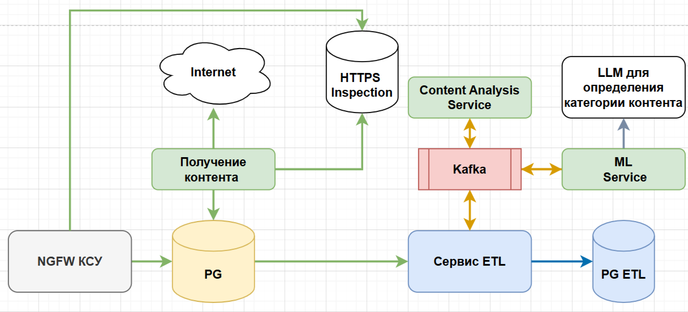
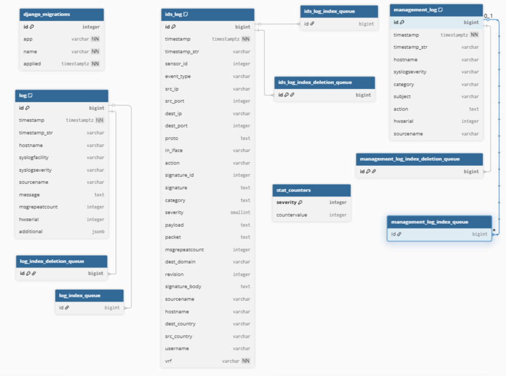
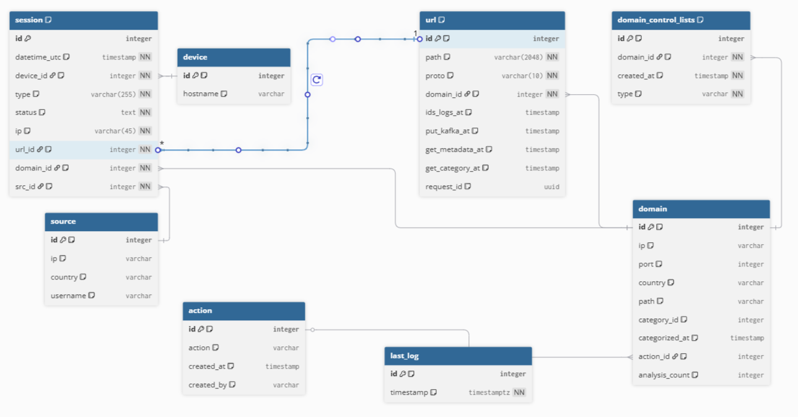
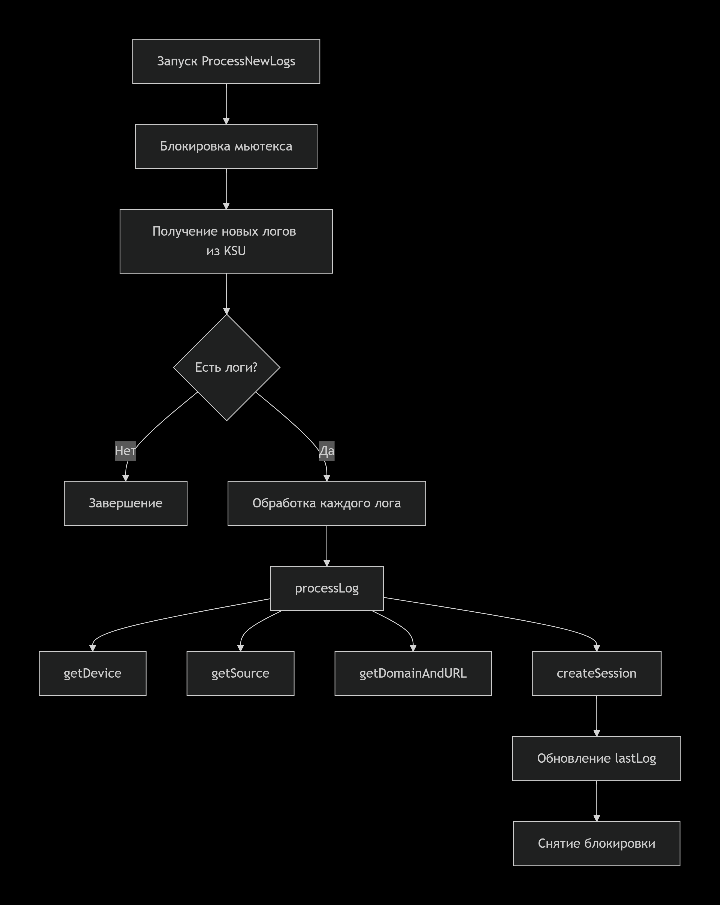

# tg-etl service

## Общее описание сервиса tg-etl

**Сервис tg-etl** - это ETL (Extract, Transform, Load) процессор для системы Traffic Guard, предназначенный для обработки и трансформации логов системы обнаружения вторжений (IDS) в структурированные данные для последующего анализа и мониторинга. Используемая версия языка программирования Go: 1.24.2

### Основные функции

1. **Обработка IDS логов**:
   - Извлечение новых логов из файервола
   - Пакетная обработка логов с настраиваемым размером батча
   - Восстановление состояния после перезапуска сервиса

2. **Трансформация и обогащение данных**:
   - Парсинг и нормализация URL, доменов и IP-адресов
   - Классификация сессий по типам и статусам безопасности
   - Обогащение данных геолокацией и категориями контента

3. **Управление сетевыми сущностями**:
   - Автоматическое создание устройств безопасности и управление ролями в Keycloak
   - Регистрация источников трафика (IP-адресов, пользователей)
   - Управление доменами и URL с категоризацией

4. **Интеграция с системой анализа**:
   - Отправка подозрительных ресурсов на анализ через Kafka
   - Управление решениями по доменам (разрешение/блокировка)
   - Отслеживание статусов анализа контента

5. **Логирование и мониторинг**:
   - Структурированное логирование процесса ETL
   - Мониторинг производительности обработки
   - Обработка ошибок с продолжением работы

### Ключевая роль

1. **Централизованная обработка безопасности**:
   - Трансформация сырых IDS логов в структурированные данные для аналитики
   - Классификация сетевой активности по уровням угроз
   - Создание единой модели данных для всей системы безопасности

2. **Оркестрация данных в реальном времени**:
   - Непрерывная обработка входящих логов с заданным интервалом
   - Поддержка состояния обработки между перезапусками сервиса
   - Гарантированная доставка данных в аналитическую систему

3. **Управление сетевыми объектами**:
   - Автоматическая регистрация новых устройств в системе
   - Интеграция с Keycloak для управления ролевым доступом
   - Поддержка актуальной информации об источниках и получателях трафика

4. **Анализ и категоризация контента**:
   - Выявление подозрительных доменов и URL
   - Автоматическая отправка на анализ в систему классификации
   - Поддержка workflow принятия решений по контенту

### Зависимости

Для корректной работы сервиса требуется предварительно запущенные:

- **PostgreSQL** - для хранения структурированных данных ETL
- **Apache Kafka** - для отправки запросов на анализ контента  
- **Keycloak** - для создания ролей при добавлении нового узла безопасности

### Интеграция в системе

[Ссылка на drawio](./Интеграция%20tg-etl.drawio)  



### Структура БД КСУ

[Описание структуры в формате dbml](./ksu.dbml)  



### Структура БД ETL

[Описание структуры в формате dbml](./etl.dbml)  



### Алгоритм обработки логов



## Детальное описание алгоритма

### 1. **Инициализация обработки** (`ProcessNewLogs`)

1. Блокировка мьютекса для обеспечения потокобезопасности
2. Получение новых логов из KSU базы начиная с последнего обработанного
3. Если логи отсутствуют - завершение обработки
4. Последовательная обработка каждого лога в батче
5. Обновление указателя на последний обработанный лог
6. Сохранение прогресса в LastLog

### 2. **Обработка отдельного лога** (`processLog`)

#### Поток данных

``` shell
IDS Log → Device → Source → Domain/URL → Session
```

**Шаги обработки:**

1. **Обработка устройства** (`getDevice`)
2. **Обработка источника** (`getSource`)
3. **Обработка домена и URL** (`getDomainAndURL`)
4. **Создание сессии** (`createSession`)

### 3. **Обработка устройства** (`getDevice`)

Алгоритм:

1. Поиск существующего устройства по SensorID
2. Если устройство найдено - возврат
3. Если не найдено - создание нового устройства
4. Интеграция с Keycloak для создания ролей
5. Возврат созданного устройства

**Особенности:**

- Автоматическое создание ролей в Keycloak для новых устройств
- Резервный режим работы без Keycloak при ошибках аутентификации

### 4. **Обработка источника** (`getSource`)

Алгоритм:

1. Поиск источника по IP адресу
2. Если найден - возврат
3. Если не найден - создание нового источника
4. Заполнение данных: IP, страна, имя пользователя

### 5. **Обработка домена и URL** (`getDomainAndURL`) - Ключевая логика

#### Варианты обработки в зависимости от данных лога

##### A. **Случай с URL** (`handleURLWithDomain`)

Условие: log.Payload != ""
Поток:

1. Парсинг rawURL для извлечения домена и пути
2. Проверка совпадения доменов из URL и log.DestDomain
3. Поиск существующего домена
4. Если домен существует → handleExistingDomainWithURL
5. Если домен новый → createNewDomainAndURL

##### B. **Случай только с доменом** (`handleDomainOnly`)

Условие: log.DestDomain != "" && log.Payload == ""
Поток:

1. Поиск домена по пути
2. Если найден - возврат с пустым URL
3. Если не найден → createDomainWithAnalysis

##### C. **Случай только с IP** (`handleIPOnly`)  

Условие: log.DestIP != "" && log.DestDomain == ""
Поток:

1. Поиск домена по IP и порту
2. Если найден - возврат с пустым URL
3. Если не найден → createDomainWithAnalysis

### 6. **Логика анализа контента**

#### Условия отправки в Kafka

```go
// Для новых доменов/URL отправка ВСЕГДА
if domain новый ИЛИ (domain существует И URL новый) {
    if домен НЕ в белом/черном списке {
        Создание AnalysisRequest
        Отправка в Kafka топик
        Обновление временных меток URL
    }
}
```

#### Структура AnalysisRequest

```go
type AnalysisRequest struct {
    RequestID uuid.UUID      // Уникальный идентификатор запроса
    Src       Src            // Источник: IP
    Dst       Destination    // Назначение: тип, ресурс, порт, протокол
    Timestamp time.Time      // Время создания запроса
}
```

### 7. **Создание сессии** (`createSession`)

#### Определение статуса сессии

```go
func processStatus(log, domain) Status {
    switch {
    case log.Action == "blocked":
        return StatusBlocked
    case домен в черном списке И actionID == 0:
        return StatusPending    // Ожидает решения
    case домен в черном списке И actionID != 0:
        return StatusAnomaly    // Запрещено
    default:
        return StatusAllowed    // Разрешено
    }
}
```

#### Определение типа сессии

```go
func processSessionType(domain) SessionType {
    if domain.CategoryType == Negative И domain.ActionID != 0 {
        return SessionTypeBlocked
    }
    return SessionTypeAllowed
}
```

### 8. **Обработка ошибок и восстановление**

**Стратегия:**

- Ошибка обработки отдельного лога не прерывает обработку батча
- Прогресс сохраняется только при успешной обработке логов
- Подробное логирование ошибок с контекстом
- Мьютекс защищает от конкурентного доступа

### 9. **Временные метки и отслеживание**

**Ключевые метки:**

- `IDSLogsAt` - время получения лога из IDS
- `PutKafkaAt` - время отправки в Kafka
- `CategorizedAt` - время категоризации домена
- `LastLog.Timestamp` - прогресс обработки

## Бизнес-логика принятия решений

### Матрица решений по доменам

| Домен в списке | ActionID | Статус сессии | Тип сессии |
|----------------|----------|---------------|------------|
| Не в списках   | -        | Allowed       | Allowed    |
| Черный список  | 0        | Pending       | Allowed    |
| Черный список  | ≠0       | Anomaly       | Blocked*   |
| Заблокирован   | -        | Blocked       | Blocked    |

*Тип Blocked только если категория Negative И принято решение

### Поток данных для анализа

``` shell
IDS Log → ETL Processing → Kafka → ML Analysis → Category Update
     ↓           ↓              ↓         ↓             ↓
   Session     Domain         Request  Analysis      Domain
     ↓                                           (update category)
  PostgreSQL                                  ↓
                                            Session
                                          (update status)
```

### Последовательность запуска

1. **Инициализация конфигурации и логгера**

    ```go
    cfg := config.Load()
    logger := slog.New(...)
    ```

   - Загрузка конфигурации из переменных окружения и файлов
   - Инициализация структурированного логгера

2. **Подключение к базе данных ETL**

    ```go
    db, err := gorm.Open(postgres.Open(dsn), &gorm.Config{})
    ```

   - Установка соединения с PostgreSQL
   - Настройка пула соединений

3. **Инициализация репозиториев и Kafka клиента**

    ```go
    q := postgres.NewQueryRepository(db)
    kc := kafka.NewClient(cfg.Kafka)
    ```

   - Создание репозитория для работы с БД
   - Инициализация Kafka продюсера

4. **Создание бизнес-логики (UseCase)**

    ```go
    u := usecase.New(cfg, q, kc, logger, userControl)
    ```

   - Инициализация основного процессора ETL
   - Загрузка последнего обработанного лога
   - Заполнение предопределенных категорий контента

5. **Запуск ETL контроллера**

    ```go
    controller := etl.New(cfg, u, logger)
    go controller.Start(ctx)
    ```

   - Создание контроллера с заданным интервалом обновления
   - Запуск в отдельной горутине для непрерывной обработки

6. **Обработка сигналов завершения**

    ```go
    <-ctx.Done()
    controller.Stop()
    ```

   - Graceful shutdown при получении сигналов ОС
   - Корректное завершение обработки

### Технологии

- **Язык**: Go 1.24.2
- **База данных**: PostgreSQL
- **Message Broker**: Apache Kafka для асинхронной коммуникации
- **Аутентификация**: Keycloak интеграция
- **Логирование**: slog со структурированным выводом
- **Документация**: Swagger/OpenAPI
- **Конфигурация**: cleanenv для загрузки настроек
- **Развертывание**: Docker-контейнеры

## Переменные окружения и параметры конфигурации

```env
# tg-etl service

# ==========================================
# ОСНОВНЫЕ НАСТРОЙКИ ПРИЛОЖЕНИЯ
# ==========================================

# Название микросервиса для идентификации в логах и метриках
ETL_APP_NAME=tg-etl

# Версия приложения для управления релизами и совместимостью
ETL_APP_VERSION=1.0.1

# Уровень детализации логирования (debug - максимальная детализация, error - только ошибки)
ETL_LOG_LEVEL=debug


# ==========================================
# НАСТРОЙКИ БАЗ ДАННЫХ
# ==========================================

# БАЗА ДАННЫХ ETL (целевая база для структурированных данных):
# Максимальное количество соединений в пуле подключений к ETL БД
ETL_PG_POOL_MAX=2
# IP-адрес или домен сервера PostgreSQL для ETL базы
ETL_PG_HOST=192.168.130.112
# Порт сервера PostgreSQL для ETL базы
ETL_PG_PORT=5433
# Имя пользователя для аутентификации в ETL БД
ETL_USER=etl_user
# Пароль пользователя для ETL БД
ETL_PASS=etl_password
# Название целевой ETL базы данных
ETL_DBNAME=etl
# Режим SSL подключения (disable - без шифрования, require - с шифрованием)
ETL_SSLMODE=disable

# БАЗА ДАННЫХ KSU (источник сырых IDS логов):
# Максимальное количество соединений в пуле подключений к KSU БД
ETL_KSU_PG_POOL_MAX=2
# IP-адрес или домен сервера PostgreSQL для KSU базы
ETL_KSU_PG_HOST=192.168.130.112
# Порт сервера PostgreSQL для KSU базы
ETL_KSU_PG_PORT=5432
# Имя пользователя для аутентификации в KSU БД
ETL_KSU_USER=ksu_user
# Пароль пользователя для KSU БД
ETL_KSU_PASS=ksu_password
# Название источника KSU базы данных
ETL_KSU_DBNAME=ksu
# Режим SSL подключения к KSU БД
ETL_KSU_SSLMODE=disable


# ==========================================
# НАСТРОЙКИ ОБРАБОТКИ ETL
# ==========================================

# Время жизни кеша в секундах для хранения промежуточных данных
ETL_CACHE_TTL=10
# Интервал в секундах между циклами обработки новых логов
ETL_REFRESH=10
# Количество логов, обрабатываемых за один цикл (размер батча)
ETL_BATCHSIZE=100
# Количество попыток анализа через ML систему при неудачных запросах
ETL_ML_ATTEMPS=20


# ==========================================
# НАСТРОЙКИ KAFKA ДЛЯ АСИНХРОННОЙ ОБРАБОТКИ
# ==========================================

# Хост Kafka брокера для подключения продюсера/консьюмера
ETL_KAFKA_HOST=192.168.130.112
# Порт Kafka брокера
ETL_KAFKA_PORT=9092
# Название топика для отправки запросов на обработку URL
ETL_KAFKA_URL_TOPIC=url-processing-requests
# Название топика для получения результатов сбора метаданных URL
ETL_KAFKA_METADATA_TOPIC=url-metadata-results
# Название топика для получения результатов ML-анализа контента
ETL_KAFKA_ML_TOPIC=ml-analysis-results


# ==========================================
# НАСТРОЙКИ ИНТЕГРАЦИИ С USERCONTROL
# ==========================================

# Протокол подключения к сервису управления пользователями (http/https)
ETL_USERCONTROL_PROTO=http
# Хост сервиса UserControl для аутентификации и управления ролями
ETL_USERCONTROL_HOST=127.0.0.1
# Порт сервиса UserControl
ETL_USERCONTROL_PORT=8002


# ==========================================
# НАСТРОЙКИ HTTP СЕРВЕРА
# ==========================================

# Сетевой интерфейс для прослушивания HTTP запросов (0.0.0.0 - все интерфейсы)
ETL_HTTP_HOST=0.0.0.0
# Порт для HTTP API сервера микросервиса
ETL_HTTP_PORT=7001


# ==========================================
# НАСТРОЙКИ ДОКУМЕНТАЦИИ API
# ==========================================

# Базовый URL для генерации Swagger документации и доступа к API
ETL_SWAGGER=0.0.0.0:7001
```

## Развертывание в системе

Для развертывания на целевой системе необходимо выполнить следующие шаги:

1. Скопировать папку проекта на целевую систему
2. Настроить переменные окружения или config.yaml
3. Запустить миграции базы данных (при необходимости)
4. Собрать и запустить контейнер:

```bash
cd ./tg-etl
docker build -t tg-etl .
docker run -d --name tg-etl -p 7000:7000 tg-etl
```

## Документация OpenAPI

> Для просмотра: откройте файл в VS Code и нажмите `F1` → `Preview Swagger`. (Должно быть установлено расширение Swagger Viewer для VS Code)

- [OpenAPI spec (YAML)](../../src/go/tg-etl/docs/swagger.yaml)  
- [Swagger JSON](../../src/go/tg-etl/docs/swagger.json)

### ETL API Endpoints

#### Проверка работоспособности сервера

- **Метод:** `GET /api/v1/healthcheck`
- **Описание:** Проверка, что сервер работает
- **Ответ:**
  - `200`: OK

#### Получение версии сервиса

- **Метод:** `GET /api/v1/version`
- **Описание:** Возвращает информацию о версии
- **Ответ:**
  - `200`: Информация о версии

### Команды Makefile

``` makefile
RUN_TYPE ?= local
ETL_URL="http://127.0.0.1:7000/swagger/doc.json"
USERCONTROL_URL="http://192.168.130.112:8002/swagger/doc.json"

# Запуск ETL микросервиса
.PHONY: run
run:
    go run ./cmd/etl/main.go -type=$(RUN_TYPE)

.PHONY: run-local
run-local:
    $(MAKE) run RUN_TYPE=local

.PHONY: run-remote
run-remote:
    $(MAKE) run RUN_TYPE=remote

# Генерация Swagger документации
.PHONY: swagger
swagger:
    swag init -g .\internal\controllers\http\v1\server.go -o ./docs

# Генерация клиента UserControl
.PHONY: gen-u 
gen-u:
    swagger generate client -c usercontrol -f $(USERCONTROL_URL) -A usercontrol -t pkg
```

## GitHub

[Ссылка на исходный код](https://github.com/il-alekseev/traffic_guard/tree/etl/src/go/tg-etl)

## Пакеты внешних зависимостей

```go
module tg-etl

go 1.24.2

require (
    // Веб-фреймворк и HTTP
    github.com/gin-gonic/gin v1.11.0 // Высокопроизводительный веб-фреймворк Gin для HTTP API
    github.com/gin-contrib/cors v1.7.6 // Middleware для обработки CORS в Gin

    // Message Broker и асинхронная обработка
    github.com/segmentio/kafka-go v0.4.49 // Клиент для работы с Apache Kafka

    // База данных и ORM
    github.com/lib/pq v1.10.9 // Драйвер PostgreSQL для Go
    gorm.io/driver/postgres v1.6.0 // Драйвер PostgreSQL для GORM
    gorm.io/gorm v1.31.0 // ORM GORM для работы с базами данных

    // Генерация идентификаторов
    github.com/google/uuid v1.6.0 // Генерация UUID для уникальных идентификаторов

    // Конфигурация приложения
    github.com/ilyakaznacheev/cleanenv v1.5.0 // Загрузка конфигурации из env файлов и переменных окружения

    // Документация API
    github.com/swaggo/files v1.0.1 // Статические файлы для Swagger UI
    github.com/swaggo/gin-swagger v1.6.1 // Интеграция Swagger с Gin фреймворком
    github.com/swaggo/swag v1.8.12 // Генератор Swagger документации

    // OpenAPI/Swagger клиент (для интеграции с UserControl)
    github.com/go-openapi/errors v0.22.3 // Обработка ошибок OpenAPI
    github.com/go-openapi/runtime v0.29.0 // Runtime компоненты для OpenAPI клиентов
    github.com/go-openapi/strfmt v0.24.0 // Форматирование строк и дат для OpenAPI
    github.com/go-openapi/swag v0.19.15 // Вспомогательные утилиты Swag
    github.com/go-openapi/validate v0.25.0 // Валидация данных OpenAPI
)

// Косвенные зависимости
require (
    github.com/BurntSushi/toml v1.2.1 // indirect // Парсер TOML формата для конфигурации
    github.com/KyleBanks/depth v1.2.1 // indirect // Анализ глубины зависимостей для Swagger
    github.com/asaskevich/govalidator v0.0.0-20230301143203-a9d515a09cc2 // indirect // Валидация данных OpenAPI
    github.com/bytedance/sonic v1.14.0 // indirect // Высокопроизводительный JSON парсер
    github.com/bytedance/sonic/loader v0.3.0 // indirect // Лоадер для Sonic парсера
    github.com/cloudwego/base64x v0.1.6 // indirect // Утилиты base64 для Sonic
    github.com/gabriel-vasile/mimetype v1.4.9 // indirect // Определение MIME-типов
    github.com/gin-contrib/sse v1.1.0 // indirect // Middleware для Gin
    github.com/go-logr/logr v1.4.3 // indirect // Логгер для OpenTelemetry
    github.com/go-logr/stdr v1.2.2 // indirect // Стандартный логгер
    github.com/go-openapi/analysis v0.24.0 // indirect // Анализ OpenAPI спецификаций
    github.com/go-openapi/jsonpointer v0.22.1 // indirect // Работа с JSON указателями
    github.com/go-openapi/jsonreference v0.21.2 // indirect // JSON ссылки
    github.com/go-openapi/loads v0.23.1 // indirect // Загрузка OpenAPI документов
    github.com/go-openapi/spec v0.22.0 // indirect // OpenAPI спецификации
    github.com/go-openapi/swag/conv v0.25.1 // indirect // Конвертация Swag данных
    github.com/go-openapi/swag/fileutils v0.25.1 // indirect // Файловые утилиты Swag
    github.com/go-openapi/swag/jsonname v0.25.1 // indirect // Имена JSON полей
    github.com/go-openapi/swag/jsonutils v0.25.1 // indirect // JSON утилиты Swag
    github.com/go-openapi/swag/loading v0.25.1 // indirect // Загрузка Swag
    github.com/go-openapi/swag/mangling v0.25.1 // indirect // Преобразование данных Swag
    github.com/go-openapi/swag/stringutils v0.25.1 // indirect // Строковые утилиты Swag
    github.com/go-openapi/swag/typeutils v0.25.1 // indirect // Утилиты типов Swag
    github.com/go-openapi/swag/yamlutils v0.25.1 // indirect // YAML утилиты Swag
    github.com/go-playground/locales v0.14.1 // indirect // Локализация валидации
    github.com/go-playground/universal-translator v0.18.1 // indirect // Переводы валидации
    github.com/go-playground/validator/v10 v10.27.0 // indirect // Валидация структур данных
    github.com/go-viper/mapstructure/v2 v2.4.0 // indirect // Преобразование map в struct
    github.com/goccy/go-json v0.10.5 // indirect // Альтернативный JSON парсер
    github.com/goccy/go-yaml v1.18.0 // indirect // Парсер YAML
    github.com/jackc/pgpassfile v1.0.0 // indirect // Аутентификация PostgreSQL через файлы
    github.com/jackc/pgservicefile v0.0.0-20240606120523-5a60cdf6a761 // indirect // Файлы службы PostgreSQL
    github.com/jackc/pgx/v5 v5.6.0 // indirect // Драйвер PostgreSQL низкого уровня
    github.com/jackc/puddle/v2 v2.2.2 // indirect // Пул соединений PostgreSQL
    github.com/jinzhu/inflection v1.0.0 // indirect // Инфлексия для GORM
    github.com/jinzhu/now v1.1.5 // indirect // Утилиты времени для GORM
    github.com/joho/godotenv v1.5.1 // indirect // Загрузка .env файлов
    github.com/josharian/intern v1.0.0 // indirect // Интернирование строк
    github.com/json-iterator/go v1.1.12 // indirect // Итератор JSON
    github.com/klauspost/compress v1.16.7 // indirect // Сжатие для Kafka
    github.com/klauspost/cpuid/v2 v2.3.0 // indirect // Оптимизации CPU
    github.com/leodido/go-urn v1.4.0 // indirect // Утилиты для валидации
    github.com/mailru/easyjson v0.7.6 // indirect // Легковесный JSON
    github.com/mattn/go-isatty v0.0.20 // indirect // Проверка терминала
    github.com/modern-go/concurrent v0.0.0-20180306012644-bacd9c7ef1dd // indirect // Конкурентные структуры данных
    github.com/modern-go/reflect2 v1.0.2 // indirect // Рефлексия
    github.com/oklog/ulid v1.3.1 // indirect // Генерация ULID
    github.com/pelletier/go-toml/v2 v2.2.4 // indirect // Парсер TOML v2
    github.com/pierrec/lz4/v4 v4.1.15 // indirect // Алгоритм сжатия LZ4 для Kafka
    github.com/quic-go/qpack v0.5.1 // indirect // QUIC протокол - qpack
    github.com/quic-go/quic-go v0.54.0 // indirect // Реализация QUIC протокола
    github.com/twitchyliquid64/golang-asm v0.15.1 // indirect // Ассемблерные оптимизации
    github.com/ugorji/go/codec v1.3.0 // indirect // Кодеки для Gin
    go.mongodb.org/mongo-driver v1.17.4 // indirect // Драйвер MongoDB (для strfmt)
    go.opentelemetry.io/auto/sdk v1.2.1 // indirect // SDK для OpenTelemetry
    go.opentelemetry.io/otel v1.38.0 // indirect // OpenTelemetry API
    go.opentelemetry.io/otel/metric v1.38.0 // indirect // Метрики OpenTelemetry
    go.opentelemetry.io/otel/trace v1.38.0 // indirect // Трейсинг OpenTelemetry
    go.uber.org/mock v0.5.0 // indirect // Генерация моков для тестирования
    go.yaml.in/yaml/v3 v3.0.4 // indirect // Парсинг YAML v3
    golang.org/x/arch v0.20.0 // indirect // Архитектурные утилиты
    golang.org/x/crypto v0.42.0 // indirect // Криптографические функции
    golang.org/x/mod v0.27.0 // indirect // Управление модулями Go
    golang.org/x/net v0.44.0 // indirect // Сетевые утилиты
    golang.org/x/sync v0.17.0 // indirect // Синхронизация горутин
    golang.org/x/sys v0.36.0 // indirect // Системные вызовы
    golang.org/x/text v0.29.0 // indirect // Текстовые утилиты
    golang.org/x/tools v0.36.0 // indirect // Инструменты разработки Go
    google.golang.org/protobuf v1.36.9 // indirect // Protocol Buffers
    gopkg.in/yaml.v2 v2.4.0 // indirect // Парсинг YAML v2
    gopkg.in/yaml.v3 v3.0.1 // indirect // Парсинг YAML v3
    olympos.io/encoding/edn v0.0.0-20201019073823-d3554ca0b0a3 // indirect // Парсер EDN формата
)
```

## Структура проекта

### Корневой уровень

``` shell
tg-etl/
│   .gitignore              # Игнорируемые файлы для Git
│   go.mod                  # Модуль Go и зависимости
│   go.sum                  # Хеши зависимостей
│   Makefile                # Команды сборки и управления
│   README.md               # Документация проекта
```

### Дерево каталогов и файлов

#### `/build` - Сборка и развертывание

``` shell
build/
├── config.yaml            # Конфигурация для сборки
├── docker-compose.yaml    # Docker Compose для развертывания
├── Dockerfile             # Docker образ приложения
└── example.env            # Пример переменных окружения
```

#### `/cmd/etl` - Точка входа приложения

``` shell
cmd/etl/
└── main.go               # Главная функция приложения, инициализация и запуск
```

#### `/config` - Конфигурация приложения

``` shell
config/
├── config.go             # Структуры и загрузка конфигурации
└── config.yaml           # Основной файл конфигурации
```

#### `/deploy` - Конфигурации развертывания

``` shell
deploy/
├── local/                # Локальное окружение разработки
│   ├── config.yaml       # Конфигурация для локальной разработки
│   └── docker-compose.yaml # Docker Compose для локального запуска
└── remote/               # Продакшн окружение
    └── config.yaml       # Конфигурация для продакшн среды
```

#### `/doc` - Документация базы данных

``` shell
doc/
├── db.dbml               # DBML схема ETL базы данных
├── db_structure.md       # Описание структуры БД в Markdown
├── ksu_db_structure.dbml # DBML схема KSU базы данных
└── image*.png           # Диаграммы и схемы архитектуры
```

#### `/docs` - Документация API

``` shell
docs/
├── docs.go              # Сгенерированная Swagger документация
├── swagger.json         # OpenAPI спецификация в JSON формате
└── swagger.yaml         # OpenAPI спецификация в YAML формате
```

### Внутренние пакеты (`/internal`)

#### `/internal/app/etl` - Ядро приложения ETL

```shell
internal/app/etl/
└── etl.go               # Основная логика инициализации ETL приложения
```

#### `/internal/controllers` - Контроллеры приложения

```shell
internal/controllers/
├── etl/                 # ETL контроллеры
│   └── etl.go          # Бизнес-логика ETL обработки
└── http/v1/            # HTTP API контроллеры
    │   handlers.go      # Обработчики HTTP запросов
    │   router.go        # Маршрутизация HTTP endpoints
    │   server.go        # HTTP сервер и настройки
    ├── dto/             # Data Transfer Objects
    │   └── responses.go # DTO для HTTP ответов
    └── middleware/      # HTTP middleware
        └── cors.go      # Middleware для CORS
```

#### `/internal/models` - Модели данных

``` shell
internal/models/
├── category.go          # Модели категорий контента
├── etl_models.go        # Основные модели ETL сущностей
├── kafka.go             # Модели для работы с Kafka
├── ksu_models.go        # Модели KSU логов (источник данных)
├── lists.go             # Модели списков (белые/черные списки)
├── session_type.go      # Типы сессий (allowed, blocked и т.д.)
└── status.go            # Статусы обработки и анализа
```

#### `/internal/repo` - Репозитории данных

``` shell
internal/repo/
├── kafka/               # Kafka клиент и репозиторий
│   ├── client.go        # Клиент для работы с Kafka
│   └── interface.go     # Интерфейсы Kafka репозитория
├── m_cache/             # In-memory кеш
│   └── m_cache.go       # Реализация кеша в памяти
├── parser/              # Парсеры данных
│   └── parser.go        # Парсер URL и других данных
└── postgresql/          # PostgreSQL репозитории
    ├── ksu_repo.go      # Репозиторий для KSU базы (источник)
    └── etl/             # Репозитории ETL базы (целевая)
        ├── category.go  # Работа с категориями
        ├── device.go    # Работа с устройствами
        ├── domain.go    # Работа с доменами
        ├── elt_repo.go  # Основной ETL репозиторий
        ├── last_log.go  # Работа с последними обработанными логами
        ├── list.go      # Работа со списками
        ├── session.go   # Работа с сессиями
        ├── source.go    # Работа с источниками трафика
        └── url.go       # Работа с URL
```

#### `/internal/usecase` - Бизнес-логика

``` shell
internal/usecase/
│   authinfo.go          # Логика аутентификации и авторизации
│   interface.go         # Интерфейсы UseCase
│   processor.go         # Основной процессор ETL логики
│   usecase.go           # Реализация основного UseCase
│   userctrl.go          # Логика работы с UserControl
├── handlers/            # Обработчики внешних событий
│   ├── composite_handler.go # Композитный обработчик
│   ├── metadata_handler.go  # Обработчик метаданных
│   └── ml_analysis_handler.go # Обработчик ML анализа
└── query/               # UseCase для запросов к данным
    ├── category.go      # Запросы категорий
    ├── device.go        # Запросы устройств
    ├── domain.go        # Запросы доменов
    ├── ksu.go           # Запросы к KSU базе
    ├── last_log.go      # Запросы последних логов
    ├── list.go          # Запросы списков
    ├── pg_interface.go  # Интерфейсы PostgreSQL
    ├── query_usecase.go # Основной UseCase запросов
    ├── session.go       # Запросы сессий
    ├── source.go        # Запросы источников
    └── url.go           # Запросы URL
```

#### `/internal/utils` - Вспомогательные утилиты

``` shell
internal/utils/
└── utils.go            # Общие вспомогательные функции
```

### Публичные пакеты (`/pkg`)

#### `/pkg/cslogger` - Кастомный логгер

``` shell
pkg/cslogger/
└── cslogger.go         # Реализация цветного логгера
```

#### `/pkg/db_structurer` - Утилиты структуры БД

``` shell
pkg/db_structurer/
└── db_structurer.go    # Утилиты для работы со структурой БД
```

#### `/pkg/models` - Публичные модели DTO

``` shell
pkg/models/
├── dto_count_response.go              # DTO счетчиков
├── dto_count_user_by_role_response.go # DTO пользователей по ролям
├── dto_count_user_for_context_response.go # DTO пользователей по контексту
├── dto_error_response.go              # DTO ошибок
├── dto_log_user.go                    # DTO логов пользователей
├── dto_pagination_meta.go             # DTO пагинации
├── dto_roles_list_response.go         # DTO списка ролей
├── dto_success_response.go            # DTO успешных ответов
├── dto_users_list_response.go         # DTO списка пользователей
├── dto_user_create_request.go         # DTO создания пользователя
├── dto_user_reset_pass.go             # DTO сброса пароля
├── dto_user_update_data.go            # DTO обновления данных
├── dto_user_update_pass.go            # DTO обновления пароля
├── models_role.go                     # Модели ролей
├── models_token.go                    # Модели токенов
└── models_user.go                     # Модели пользователей
```

#### `/pkg/pgorm` - Утилиты GORM

``` shell
pkg/pgorm/
├── options.go          # Опции подключения к PostgreSQL
└── postgres.go         # PostgreSQL клиент и утилиты
```

#### `/pkg/slogger` - Структурированный логгер

``` shell
pkg/slogger/
│   error.go            # Ошибки и обработка ошибок логирования
│   logctx.go           # Контекст логирования
│   README.md           # Документация логгера
│   slogger.go          # Основной структурированный логгер
└── wsl/                
    └── wraper.go       # Обертки для WSL окружения
```

#### `/pkg/usercontrol` - Клиент UserControl API

``` shell
pkg/usercontrol/
│   usercontrol_client.go # Основной клиент UserControl
├── auth/                # Аутентификация
│   ├── auth_client.go   # Клиент аутентификации
│   ├── post_v1_auth_refresh_parameters.go
│   ├── post_v1_auth_refresh_responses.go
│   ├── post_v1_auth_sign_in_parameters.go
│   ├── post_v1_auth_sign_in_responses.go
│   ├── post_v1_auth_sign_out_parameters.go
│   └── post_v1_auth_sign_out_responses.go
├── roles/               # Управление ролями
│   ├── delete_v1_roles_context_parameters.go
│   ├── delete_v1_roles_context_responses.go
│   ├── get_v1_roles_count_parameters.go
│   ├── get_v1_roles_count_responses.go
│   ├── get_v1_roles_parameters.go
│   ├── get_v1_roles_responses.go
│   ├── put_v1_roles_context_parameters.go
│   ├── put_v1_roles_context_responses.go
│   └── roles_client.go
└── users/               # Управление пользователями
    ├── delete_v1_users_user_id_parameters.go
    ├── delete_v1_users_user_id_responses.go
    ├── delete_v1_users_user_id_roles_parameters.go
    ├── delete_v1_users_user_id_roles_responses.go
    ├── get_v1_users_count_by_role_parameters.go
    ├── get_v1_users_count_by_role_responses.go
    ├── get_v1_users_count_context_context_id_parameters.go
    ├── get_v1_users_count_context_context_id_responses.go
    ├── get_v1_users_count_parameters.go
    ├── get_v1_users_count_responses.go
    ├── get_v1_users_parameters.go
    ├── get_v1_users_profile_parameters.go
    ├── get_v1_users_profile_responses.go
    ├── get_v1_users_responses.go
    ├── get_v1_users_user_id_parameters.go
    ├── get_v1_users_user_id_responses.go
    ├── post_v1_users_parameters.go
    ├── post_v1_users_responses.go
    ├── put_v1_users_profile_pass_parameters.go
    ├── put_v1_users_profile_pass_responses.go
    ├── put_v1_users_user_id_parameters.go
    ├── put_v1_users_user_id_pass_otp_parameters.go
    ├── put_v1_users_user_id_pass_otp_responses.go
    ├── put_v1_users_user_id_responses.go
    ├── put_v1_users_user_id_roles_parameters.go
    ├── put_v1_users_user_id_roles_responses.go
    └── users_client.go
```

### Назначение основных компонентов

#### **Архитектура данных**

- `internal/models/` - Доменные модели для всех сущностей системы
- `pkg/models/` - Публичные DTO для API взаимодействия

#### **Бизнес-логика**

- `internal/usecase/` - Ядро бизнес-логики ETL процесса
- `internal/usecase/handlers/` - Обработчики внешних событий (Kafka)

#### **Доступ к данным**

- `internal/repo/postgresql/` - Репозитории для работы с двумя БД (KSU и ETL)
- `internal/repo/kafka/` - Асинхронная коммуникация через Kafka

#### **Инфраструктура**

- `pkg/slogger/` - Единое структурированное логирование
- `pkg/usercontrol/` - Интеграция с системой аутентификации
- `pkg/pgorm/` - Утилиты для работы с PostgreSQL

#### **Конфигурация и развертывание**

- `config/`, `deploy/` - Гибкая конфигурация для разных окружений
- `build/` - Docker и контейнеризация приложения

#### **Документация**

- `docs/` - Автогенерируемая Swagger документация API
- `doc/` - Документация базы данных и архитектуры
