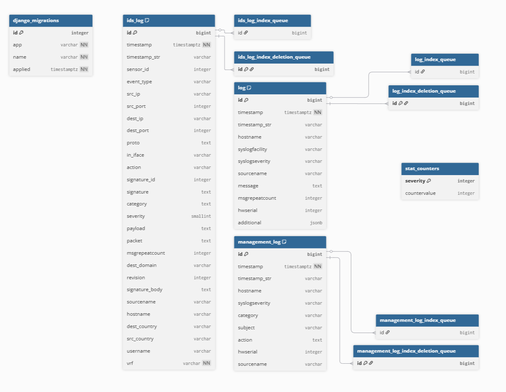
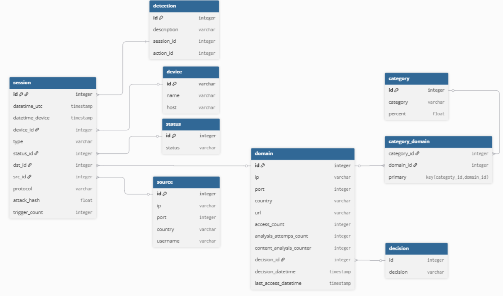

# Структура базы данных

На рисунке ниже представлена структура БД, в которую отправляются логи



Декларативное описание структуры в формате DBML

```sql
// Database Schema for Security Logging System
// Generated from PostgreSQL inspection

Table django_migrations {
  id integer [primary key]
  app varchar [not null]
  name varchar [not null]
  applied timestamptz [not null]
}

Table ids_log {
  id bigint [primary key]
  timestamp timestamptz [not null]
  timestamp_str varchar
  sensor_id integer
  event_type varchar
  src_ip varchar
  src_port integer
  dest_ip varchar
  dest_port integer
  proto text
  in_iface varchar
  action varchar
  signature_id integer
  signature text
  category text
  severity smallint
  payload text
  packet text
  msgrepeatcount integer
  dest_domain varchar
  revision integer
  signature_body text
  sourcename varchar
  hostname varchar
  dest_country varchar
  src_country varchar
  username varchar
  vrf varchar [not null]
  
  indexes {
    (timestamp) [name: 'idx_ids_log_timestamp']
    (src_ip) [name: 'idx_ids_log_src_ip']
    (dest_ip) [name: 'idx_ids_log_dest_ip']
    (signature_id) [name: 'idx_ids_log_signature_id']
    (severity) [name: 'idx_ids_log_severity']
  }
}

Table ids_log_index_deletion_queue {
  id bigint [primary key]
}

Table ids_log_index_queue {
  id bigint
}

Table log {
  id bigint [primary key]
  timestamp timestamptz [not null]
  timestamp_str varchar
  hostname varchar
  syslogfacility varchar
  syslogseverity varchar
  sourcename varchar
  message text
  msgrepeatcount integer
  hwserial integer
  additional jsonb
  
  indexes {
    (timestamp) [name: 'idx_log_timestamp']
    (hostname) [name: 'idx_log_hostname']
    (sourcename) [name: 'idx_log_sourcename']
  }
}

Table log_index_deletion_queue {
  id bigint [primary key]
}

Table log_index_queue {
  id bigint
}

Table management_log {
  id bigint [primary key]
  timestamp timestamptz [not null]
  timestamp_str varchar
  hostname varchar
  syslogseverity varchar
  category varchar
  subject varchar
  action text
  hwserial integer
  sourcename varchar
  
  indexes {
    (timestamp) [name: 'idx_management_log_timestamp']
    (category) [name: 'idx_management_log_category']
    (syslogseverity) [name: 'idx_management_log_severity']
  }
}

Table management_log_index_deletion_queue {
  id bigint [primary key]
}

Table management_log_index_queue {
  id bigint
}

Table stat_counters {
  severity integer [primary key]
  countervalue integer
}

// Relationships and Notes

Ref: ids_log_index_queue.id > ids_log.id
Ref: log_index_queue.id > log.id
Ref: management_log_index_queue.id > management_log.id

Ref: ids_log_index_deletion_queue.id > ids_log.id
Ref: log_index_deletion_queue.id > log.id
Ref: management_log_index_deletion_queue.id > management_log.id

```

На рисунке ниже представлена структура БД ядра ETL



Декларативное описание структуры в формате DBML

```sql
// Use DBML to define your database structure
// Docs: https://dbml.dbdiagram.io/docs

Table session {
  id integer [primary key]
  datetime_utc timestamp
  datetime_device timestamp
  device_id integer
  type varchar
  status_id integer
  url varchar
  dst_id integer
  src_id integer
  protocol varchar
  attack_hash float
  trigger_count integer
}

Table device{
  id varchar [primary key]
  name varchar
  host varchar
}

Table source{
  id integer [primary key]
  ip varchar
  port integer
  country varchar
  username varchar
}

Table domain{
  id integer [primary key]
  ip varchar
  port integer
  country varchar
  path varchar
  access_count integer
  analysis_attemps_count integer
  content_analysis_counter integer
  decision_id integer
  decision_datetime timestamp
  last_access_datetime timestamp
}

Table decision{
  id integer
  decision varchar
}

Table detection{
  id integer [primary key]
  description varchar
  session_id integer
  action_id integer
}

Table status{
  id integer [primary key]
  status varchar
}

Table category{
  id integer [primary key]
  category varchar
  percent float
}

Table category_domain{
  category_id integer
  domain_id integer
  primary key(categoty_id, domain_id)
}

Ref: "source"."id" < "session"."src_id"

Ref: "domain"."id" < "session"."dst_id"

Ref: "status"."id" < "session"."status_id"

Ref: "decision"."id" < "domain"."decision_id"

Ref: "category_domain"."category_id" > "category"."id" 

Ref: "category_domain"."domain_id" > "domain"."id"  

Ref: "detection"."session_id" < "session"."id"

Ref: "device"."id" < "session"."device_id"
```
